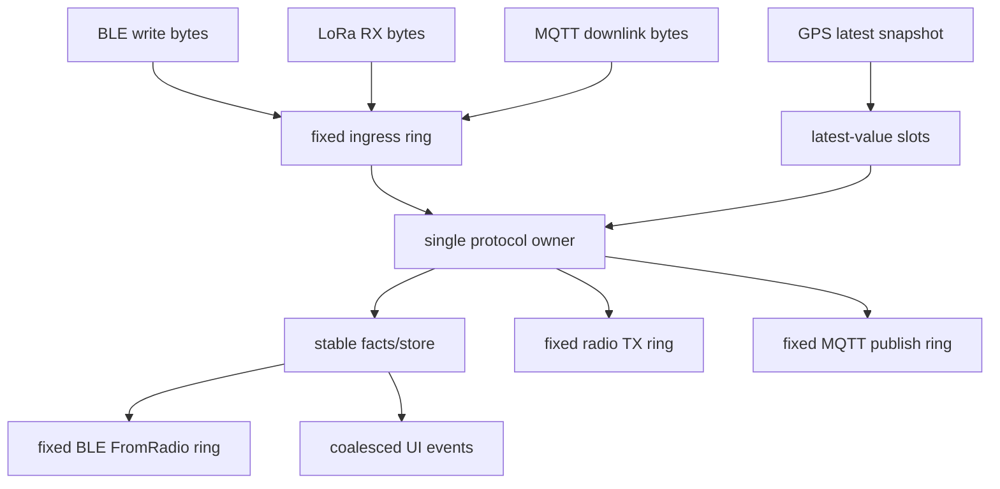
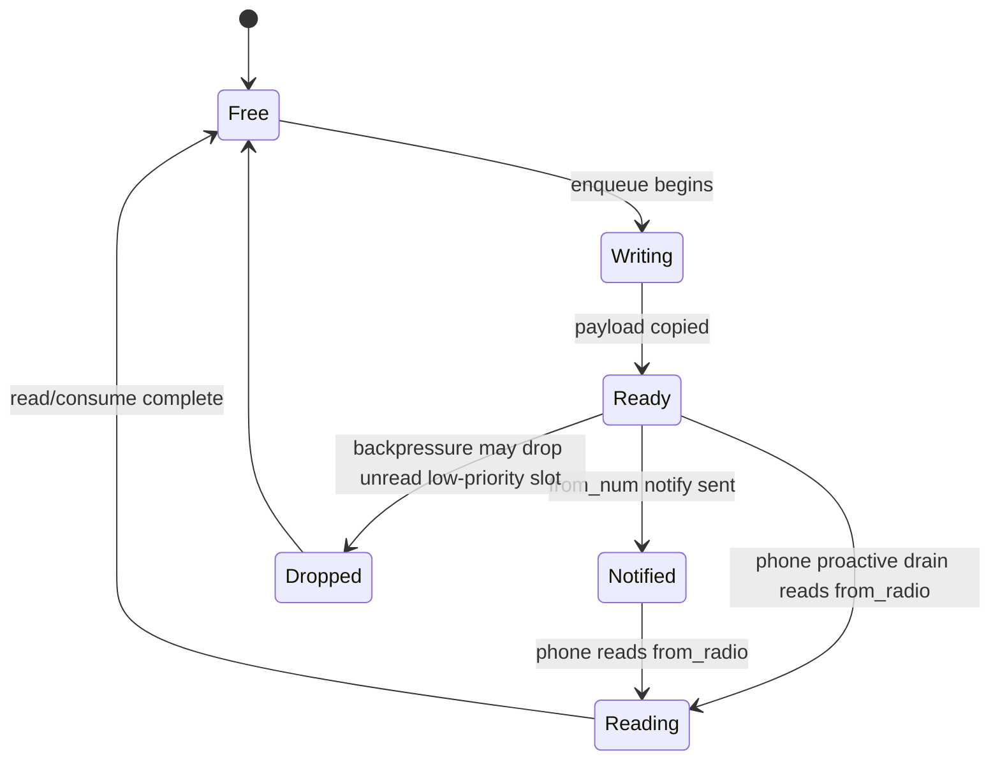
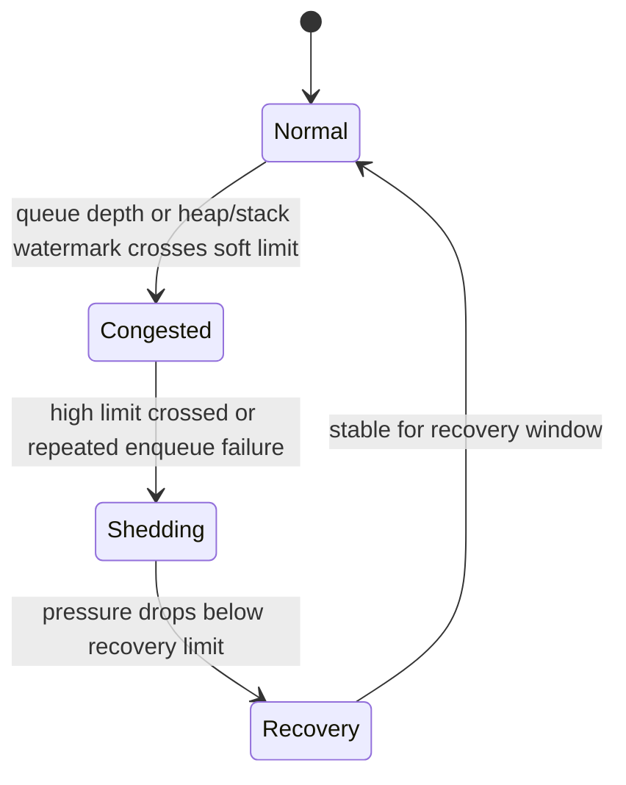
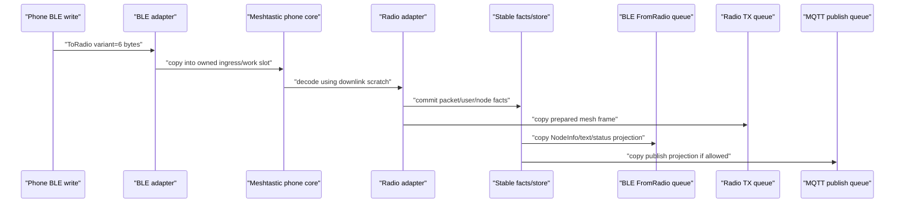
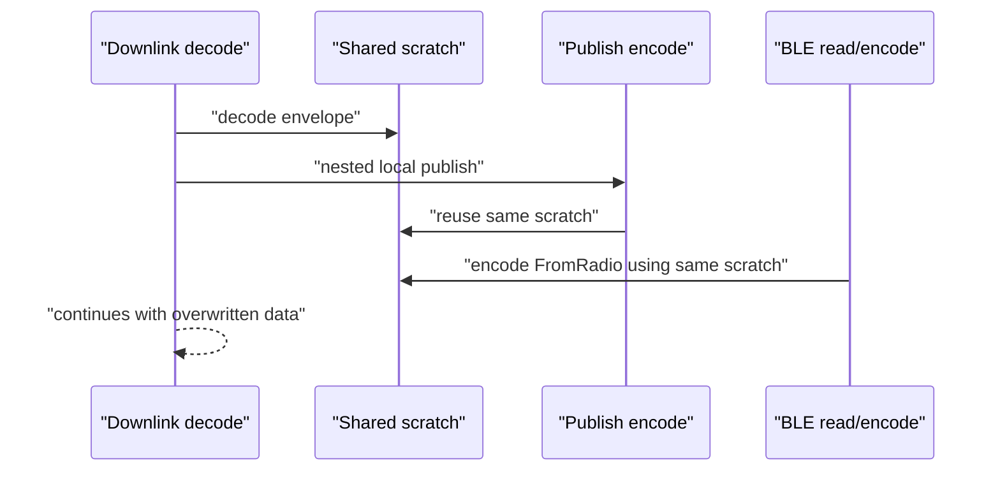

# Meshtastic Protocol Bridge Memory Model

This specification defines Trail Mate's memory ownership model for Meshtastic BLE / MQTT / LoRa / UI / GPS interleaved runtimes
. It is not the atomic memory model in the C++ standard, but the
crash-prevention specifications of the firmware protocol bridge: who owns a piece of memory, how long it can live, when it can be reused, which
 paths are allowed to be discarded, and which paths must not borrow short-lifecycle data.

The goal is very clear:

```text
I would rather lose low-priority projections than crash.
It is better to reduce throughput than to allow shared buffers, queue slots, or callback stacks to enter an undefined state.
```

This specification is applicable to ESP32, nRF52, and Linux simulator/test runtime. The platform can choose different capacities and
thresholds, but cannot change the semantics of ownership / lifecycle / backpressure.

## Relationship To Existing Specifications

See `RUNTIME_CONCURRENCY_SPEC.md` for concurrency entry and thread/task boundaries.

Meshtastic Android App's BLE connection, `ToRadio` / `FromRadio` / `FromNum`
drain, configuration snapshot, response-drain-before-save rules, see
`MESHTASTIC_ANDROID_BLE_CONNECTION_SPEC.md`.

Meshtastic protocol business rules owner see `MESHTASTIC_PROTOCOL_POLICY_SPEC.md`.

For cross-platform protocol behavior consistency, see `PROTOCOL_ADAPTER_PARITY_SPEC.md`.

This specification only defines memory ownership, life cycle, queue backpressure and scratch reuse rules. It does not redefine
Meshtastic protocol business semantics.

## Core Distinctions

### Memory Capacity vs Memory Ownership

The problem of memory capacity is "can the system be able to put down more objects?" PSRAM, smaller queues, and reduced cache can alleviate this problem.

The memory ownership problem is "A is still using a buffer, but B has overwritten or released it". PSRAM cannot be repaired
This question.

Therefore the following issues must be handled as ownership defects rather than insufficient RAM:

- published BLE `FromRadio` slot is overwritten before the phone reads it;
- queue item saves stack local, callback buffer or scratch pointer;
- MQTT downlink decode and MQTT publish encode reuse the same block scratch;
- BLE callback / radio RX / MQTT handler creates large protobuf/frame/config objects on the stack;
- The fact layer object borrows the backing storage of the projection layer or scratch.

### Facts vs Projections

The fact layer is the system's stable record of the mesh world:

```text
MeshPacket
User / NodeInfo
ChannelSettings
ModuleConfig
local message record
dedup state
pending admin/status action
```

The projection layer is the view required by a certain consumer:

```text
BLE FromRadio frame
UI message item
MQTT publish envelope
raw MQTT proxy packet
GPS display event
telemetry display event
```

The fact layer must stably own its own data. Projection layers can be discarded, merged, or reconstructed. The projected layer must not be the only truth,
You must not contaminate the fact layer with your own life cycle.

### Scratch vs Stable Storage

scratch is a temporary workbench for a single execution phase. It can only be used within the owner's synchronous call phase.

Stable storage is a queue slot, store, domain object, or persistent buffer. It can work across contexts,
Survives across callbacks and event pump steps.

It is forbidden to use scratch as stable storage.

## Execution Contexts

The following contexts may be interleaved:

```text
BLE stack callback
BLE notify/read path
radio IRQ / RX poll / TX completion
MQTT downlink handler
MQTT publish handler
protocol worker / app event pump
GPS UART/parser/timer
UI event loop
config save/load task
storage/filesystem callback
```

Single-core platforms must also be treated as concurrent systems. Risks come from callback insertion, task switching, event nesting and synchronization
Call chain reentrancy does not only come from simultaneous execution on multiple cores.

## Object Classes

| Class | Examples | Owner | Lifetime Rule |
| --- | --- | --- | --- |
| External input buffer | BLE write bytes, radio RX bytes, MQTT envelope bytes | SDK/driver/callback | Only valid in the current callback or poll step; must be copied before it can be used across boundaries. |
| Ingress slot | fixed ring item containing copied bytes | ingress queue | Stable and effective from enqueue to protocol worker consume. |
| Protocol fact | MeshPacket, User, NodeInfo, config, local message | shared protocol/domain store | May not borrow callback, stack, or scratch storage. |
| Projection | BLE FromRadio, UI item, MQTT publish envelope | target output queue | Can be lost, merged, and reconstructed; the fact layer must not be reversely defined. |
| Queue slot | BLE/radio/MQTT/UI fixed ring slot | queue owner | slot After publishing, it cannot be overwritten before consumption is completed. |
| Runtime payload bytes | `IncomingPacket.payload`, `SendPacketEffect.payload`, route/update payload | protocol runtime caller/effect consumer | Must be a fixed upper limit of owned bytes; hot-path `std::vector` cannot be used as the protocol fact carrier. |
| Scratch | decode/encode/temp protobuf/log buffer | declaring owner | Cannot cross asynchronous boundaries, cannot enter queue/store, and cannot be nested and reused. |

## Canonical Runtime Shape

The safest operating form is: callback only copies and delivers events, and complex protocol processing is completed serially by a single owner.



If a platform cannot fully converge to a single worker for the time being, the following invariants must still be maintained:

- callback does not hold external buffers across the callback life cycle;
- callback does not create large protocol objects on the stack;
- queue slot owns the payload;
- scratch is not shared across paths;
- published slot is not overwritten;
- low-value projections are discarded according to priority during high pressure.

## Mandatory Invariants

### R1 External Buffers Are Never Borrowed Across Contexts

The input buffer provided by BLE, radio, MQTT, filesystem, and GPS driver must not enter the
queue, store, UI, BLE projection, or MQTT publish path in the form of pointers or references.

Cross-context transfers must be copied to owner's explicit storage:

```text
callback buffer -> ingress slot bytes
decode scratch -> fact/store owned fields
projection scratch -> output queue slot bytes
```

### R2 Queue Slots Own Their Payload

The protocol bridge queue item must have its own payload storage, or have clear fixed arena allocation.
Queue item is prohibited from saving pointers of stack local, callback buffer, and scratch buffer.

Illegal form:

```cpp
queue.push({.payload = scratch.data(), .len = scratch_len});
```

Legal form:

```text
slot.bytes[0..len] contains an owned copy
slot.len records copied length
slot.metadata records immutable routing/projection metadata
```

### R3 Published BLE FromRadio Slots Are Stable Until Consumed

BLE `FromRadio` queue must comply with the following life cycle:



 Slots in the `Ready`, `Notified` and `Reading` states must not be overwritten. `from_num` notify is a wake-up signal,
Not a read permission or ownership boundary; Meshtastic Android app will actively drain after writing `ToRadio`
`from_radio`, so the frame that has been encoded into the slot must be consumed by proactive read. When the queue is full, it can only
discard unread low-priority slots that are allowed to be discarded, or reject new low-priority projections.

Each encoded `FromRadio` slot must carry the immutable generated by `MeshtasticPhoneCore`
projection metadata:

```text
kind     = config | liveness | queue_status | admin_response | node_info | packet | mqtt_proxy
priority = P0 | P1 | P2 | P3
```

These metadata are release/backpressure semantics, not new protocol facts. The transport can choose to retain,
 delay, discard or log by metadata; the transport must not re-parse the `FromRadio` protobuf to judge the importance, nor
Use `from_num`, payload length, whether it has been notified and other transmission traces to derive the frame type.

### R4 Hot Paths Do Not Allocate Large Automatic Objects

The following paths must not create large automatic locals:

```text
BLE write/read/notify callbacks
radio RX/TX hot path
MQTT downlink/publish hot path
config save/load task hot path
GPS/UI cross-context handoff
```

Prohibited objects include but are not limited to:

```text
MeshtasticBleFrame
full protobuf/nanopb config structs
meshtastic_Data / MeshPacket work structs
large uint8_t or char arrays
large std::string temporary assembly
std::deque node allocations in hot path
```

Such objects must enter member scratch, fixed queue slot, static storage with declared owner,
or caller-provided output storage.

BLE `ToRadio` input bytes is a one-time execution parameter, not a long-term protocol state. The bridging layer can be found in
The `handleToRadio()` phase decodes it to the owner's explicit scratch, but MUST NOT retain a complete
 "last ToRadio" shadow copy, unless this copy has an explicit consumer and a declared lifetime. debug traces,
future convenience, or "maybe useful in the future" are not legal owners.

### R5 Scratch Is Stage-Local And Non-Reentrant

scratch must be partitioned by purpose. At least it should be distinguished:

```text
downlink_decode_scratch
radio_rx_decode_scratch
radio_tx_scratch
mqtt_publish_scratch
ble_encode_scratch
config_io_scratch
log_hex_scratch
```

Disallow one `mqtt_scratch_` to serve at the same time:

```text
handleMqttProxyMessage()
injectMqttEnvelope()
queueMqttProxyPublish()
queueMqttProxyPublishFromWire()
BLE FromRadio encode
```

The reason is that local RX, MQTT publish and BLE may be triggered simultaneously during the MQTT downlink inject process
projection. Shared scratch will be overwritten in nested paths.

### R6 Runtime Queues Are Bounded

The queue during protocol bridge operation must have a fixed capacity and declare an overflow policy. Introducing
unbounded `std::deque`, unbounded `std::vector` growth or fallback heap allocation in ESP/nRF hot paths is prohibited.

Each queue must answer:

```text
who writes
who reads
when a slot becomes published
when a slot may be reused
what happens when full
which priorities may be dropped
```

### R6.1 Runtime Ingress And Effects Use Bounded Owned Bytes

The payload/path/public-key bytes on the `IProtocolRuntime` boundary are the
 interface between stable facts and platform projections. They must use fixed-capacity owned storage:

```text
IncomingPacket.payload      <= protocol payload cap
IncomingPacket.path         <= protocol path cap
SendPacketEffect.payload    <= protocol payload cap
UpdatePeerRouteEffect.key   <= protocol public-key cap
UpdatePeerRouteEffect.bytes <= protocol payload cap
```

When the platform adapter constructs `IncomingPacket` from LoRa/MQTT/BLE decode scratch, it must check whether bounded
copy is successful. The failure semantics are fail-closed:

```text
copy ok     -> call runtime
copy failed -> drop this runtime projection, log/counter, do not call runtime with empty payload
```

This rule intentionally distinguishes "payload too large" from "empty payload". The empty payload can be a legal protocol fact;
The empty buffer after the copy fails is not a fact and cannot continue to flow into the runtime handler.

### R6.2 App-Facing Incoming Queues Use Fixed Slots

`MeshIncomingText` / `MeshIncomingData` is a projected DTO on the boundary of app/UI/adapter. They can revert to `std::string` / `std::vector` at the consumption boundary
, but the hot path enqueuing phase must not be relied on
`std::queue<MeshIncoming*>`, `std::deque<MeshIncoming*>` or runtime heap expansion.

All protocol adapters that implement `IMeshAdapter::pollIncomingText()` / `pollIncomingData()` must be shared
The same set of app-facing incoming queue rules. Currently this includes at least Meshtastic, MeshCore, RNode and LXMF:

```text
RX/decode buffer -> fixed incoming queue slot owns copied text/payload bytes
fixed incoming queue slot -> pollIncoming*() restores MeshIncoming* DTO for consumer
```

Unified priority backpressure rules must be used when the queue is full. P1 user messages and NodeInfo/User related projections should be retained as much as possible;
P2/P3 projection must not crowd out P0/P1. The platform only allows adjusting the number of slots and the upper limit of payload, and does not allow re-implementation of one set.
Bypass queues with different semantics.

BLE app-facing frame queues must also follow the same rules. MeshCore / Meshtastic BLE service's
RX, TX, and offline message frames are all projection frames:

```text
BLE callback bytes -> fixed RX frame slot -> command handler -> slot released
protocol response  -> fixed TX frame slot -> notify ok       -> slot released
offline message    -> fixed offline slot  -> pop/copy ok     -> slot released
advert/hash dedup  -> fixed small table, oldest hash evicted when full
active connection  -> fixed small table, expired/oldest slot reused when full
```

When the queue is full, the oldest common projection frame can be discarded and log/counter recorded; it must not be used in BLE callback
 to absorb pressure through `std::deque` or heap expansion. The offline slot must not be released when the reader buffer is insufficient.
The advert deduplication and active connection keepalive inside the BLE service are also run-time projection states and must use
 fixed small tables; they cannot trigger heap allocation through vector push/erase in the connection or advert high-frequency stage.

The BLE TX frame queue inside the shared phone core also belongs to the same type of projection queue. it can be used
Fixed depth defined by the platform profile, but must not be expanded during command processing using `std::deque<MeshCoreBleFrame>`.
There is a fixed maximum length of the command accumulation area on the protocol, such as the 8KiB buffer of MeshCore SIGN_DATA, which must be fixed.
owned storage and length count; must not be incrementally expanded via `reserve()` / `insert()` in the BLE command stream.

### R6.3 Protocol Runtime Effects Use Caller-Owned Fixed Batches

`ProtocolEffects` is a batch of actions that the protocol runtime passes "fact processing results" to the adapter for execution. it is not
The fact layer store is not a platform-private projection queue; ESP, nRF and Linux must share the same set of batch semantics.

Rules:

```text
adapter/facade-owned ProtocolEffectWorkspace
    -> runtime handler writes effects into workspace.primary
    -> adapter executor consumes workspace.primary
    -> tx feedback writes at most one action result into workspace.feedback
```

`ProtocolEffects` must not use hot-path `std::vector` / `std::deque` or runtime heap expansion and absorption
pressure. An explicit overflow state must be set when the batch is full, and the caller can choose to defer, discard low-value projections, or record
counter, but no further emergency buffer allocations are allowed.

`ProtocolEffects` must also not be passed between runtime/facade as hot-path by-value return objects.
The largest variant of `ProtocolEffect` contains owned payload/public-key bytes, fixed 8-slot batch
Approximately a few KiB on a 32-bit target; putting this into each runtime handler's automatic local variable converts heap
 risk into stack/temporary risk. The correct boundary is: the caller or long-lived adapter/runtime UI
 object holds `ProtocolEffectWorkspace`, and the runtime handler only writes actions to the incoming batch.

The batch capacity must be designed according to "normal synchronization processing burst" instead of infinite backlog design. Batch ACK timeout
This type of deferrable projection must retain pending facts that have not been consumed when the batch is full, and wait for the next round of ticks to continue output;
You must not delete pending facts first and then silently lose the results because the effect batch is full.

`MeshProtocolFacade` must not bring its own fixed batch member and then be temporarily constructed on the stack; it must reference external
`ProtocolEffectWorkspace`. This workspace only allows one full master batch; the TX feedback line must be used
Dedicated 1-slot batch, because the current runtime can only produce at most one action result for a TX result. platform
The adapter and embedded UI runtime must have workspace as a member or other explicit lifetime owned
storage; Linux/tests can use local workspaces, but must still be injected explicitly.

### R6.4 Protocol Runtime Pending State Uses Fixed Tables

The pending state inside the protocol runtime is also the hot path state and is not allowed to pass `std::deque` /
Runtime expansion of `std::vector` holds the information needed for future state machines.

Current rules:

```text
pending app ACK       -> fixed slot table, full table drops oldest with explicit Failed effect
packet history/dedup  -> fixed slot table, TTL prune + declared oldest/drop-first policy
pending retransmit    -> fixed slot table, slot owns wire bytes until terminal state
```

These states are not UI projections; they affect ACK, deduplication, fallback retransmit, observed relay, and
Whether the message is forwarded again. When the table is full, the low value/oldest state can be discarded according to the declared rules, but the heap must not be implicitly allocated.
References to scratch or temporary decoded packets must also not be saved.

### R6.5 Route / Identity Runtime State Uses Fixed Tables

The routing, identity, and public key verification status within the protocol adapter is also a runtime fact cache. They are not part of the UI projection,
It is also not possible to use hot-path `std::vector` expansion to record the status required for future sending, decryption, identity display or key verification
.

Current rules:

```text
peer route cache          -> fixed slot table, TTL prune + oldest-drop when full
verified peer state       -> fixed slot table, oldest-drop when full
persisted public-key save -> fixed member scratch, newest-seen entries retained
Meshtastic PKI key table  -> fixed slot table, oldest-seen eviction when full
Meshtastic node runtime   -> fixed slot table, oldest-touch eviction when full
```

The capacity of these tables can be adjusted according to the platform profile, but the same semantics must be retained: the route slot owns the path,
pubkey, advert and candidate path; the verified slot owns the NodeId; persistent storage must not temporarily construct an unbounded vector for sorting or filtering.
 When the table is full, slots can only be released according to the declared oldest/expired rules, and cannot be saved in RX/TX or configuration
 path.

Meshtastic `node runtime` is currently only allowed to carry the latest channel and nodeinfo reply throttling time.
Protocol runtime index; the "status shadow" with only writing and no reading must be deleted and cannot be moved into a fixed table and disguised as facts.
The slot of the PKI key table owns the 32B public key and the last seen time; when saving to the persistence layer, use the
 member staging array instead of temporarily constructing a growable list in the hot path or save path. ESP and nRF must share
this set of rules and only allow capacity to vary based on platform profile.

### R7 Sensor And UI Streams Are Coalesced

GPS, battery, telemetry, and UI invalidation default to latest-value or coalesced stream.

They must not occupy BLE/MQTT/LoRa main protocol bridge resources in the form of "every sample must be queued for processing".

GPS high pressure rule:

```text
latest wins
old samples may be skipped
UI updates may be delayed
protocol bridge memory must not be blocked by GPS history
```

### R8 Fail Closed On Decode/Encode/Queue Failure

After failure, the current item must be discarded or the submitted fact must be retained, and the semi-initialized object must not be continued.

```text
decode failed -> drop input slot, release storage, increment counter
encode failed -> drop projection, keep already committed facts
queue full -> apply declared drop policy, never allocate emergency heap buffer
config save busy -> coalesce dirty state, never recursively save
```

Disable continued use of `len`, partially decoded protobuf, expired pointer or temporary fallback buffer after failure.

### R9 Platform Profiles May Change Capacity, Not Semantics

ESP32, nRF52, and Linux can choose different queue depth, slot count, scratch placement and drop
threshold. They cannot change the following semantics:

- queue slot ownership;
- published slot stability;
- scratch non-reentrancy;
- fact/projection boundary;
- priority-based backpressure;
- Shared rules for MQTT downlink / BLE projection / NodeInfo projection.

## Backpressure Policy

When resources are tight, the system must enter an orderly downgrade instead of continuing to expand or blocking the main protocol bridge.



### Priority Classes

| Priority | Meaning | Examples | Drop Rule |
| --- | --- | --- | --- |
| P0 | Session liveness / required responses | BLE pairing/auth/session responses, admin/config response, active send status/ACK, response-drain-before-save state | Must not be discarded due to normal back pressure; if it cannot be retained, it must enter explicit failure state. |
| P1 | User-visible protocol facts | text message, direct message, node/user identity needed by app display, routing error/status, channel/config snapshot | Keep as much as possible; can be delayed and should not be squeezed out by P2/P3. |
| P2 | Latest-value or coalescible data | GPS position, telemetry, battery/status heartbeat, repeated NodeInfo/User, map/report | Can discard the old and keep the new, can merge. |
| P3 | Diagnostic or raw projection | raw MQTT proxy envelope for phone, duplicate packets, stale UI refresh, debug/log projection, old broadcast metadata | High voltage is discarded first. |

P3 is the first pressure relief layer to be discarded, but is not the permanent starvation layer. For P3 projections such as MQTT proxy that bear
device->phone->broker forwarding responsibilities, the `SendPackets` phase must have bounded
fairness: without P0/P1 and deferred side effect, after giving way to P2/P3 several times in succession,
 can deliver a pending MQTT proxy frame. This rule does not change the drop order; it only prevents strict
priority from actually starving MQTT upstream and downstream under continued low-priority traffic.

### Drop Order

When the pressure is high, release the pressure in the following order:

1. Discard P3 unpublished projection.
2. Merge P2 latest-value stream and keep only the latest value.
3. Discard duplicate P2 projections, such as the old telemetry / NodeInfo projection of the same node.
4. Delay UI refresh, GPS display update, diagnostic log projection.
5. Reject new low-priority input and record counter.
6. Only when P0/P1 cannot be retained, enter explicit failure state; silent corruption is not allowed.

## Pending TX / ACK Wire Slots

radio retransmit, implicit ACK observation, and pending ACK retry all belong to pending wire ownership.
What they save is not a temporary projection, but the complete wire packet that may be sent again in the future or required to complete the state machine.

Therefore these objects must use fixed slot table:

```text
slot.key = packet id / from+packet id
slot.priority = P0/P1/P3
slot.wire[] owns copied packet bytes
slot.metadata owns retry/ack/routing metadata
```

It is forbidden to use `map<id, vector<uint8_t>>`, `deque<vector<uint8_t>>` or runtime expansion container storage
pending wire. The platform can choose different slot count and maximum wire length, but cannot change the following rules:

- P0 active local ACK/status must not be squeezed out by normal pressure; if the table is full and cannot be retained, it must fail explicitly and report the status.
- P1 retransmit/fallback may be retained, but must not crowd out P0.
- P3 observe-only / duplicate metadata is the first pending wire to be discarded.
- The wire bytes in the slot cannot be overwritten by scratch or new packets before the pending state ends.

## MQTT Downlink Ownership Flow

The MQTT downlink is the critical pressure path for this specification. The correct life cycle is as follows:



Forbidden flow:



Under low pressure, this error may only appear as sender error, `???`, message disappearance or unread status exception; under high pressure,
 it may appear as GPS corrupt, HardFault, assert, stack canary or restart without logs.

## Platform Profiles

### nRF52 Profile

nRF52 is the strictest profile:

```text
small fixed BLE FromRadio queue
small MQTT proxy queue
latest-value GPS/telemetry
coalesced UI refresh
no large automatic protocol objects
no unbounded STL hot-path queues
aggressive P2/P3 shedding
explicit counters for dropped projections
```

### ESP32 Without PSRAM Profile

No PSRAM ESP32 shares the same ownership rules as nRF52 and can use slightly larger capacity, but must not relax
hot-path stack and queue bound constraints.

### ESP32 With PSRAM Profile

ESP32 with PSRAM can put large caches, fonts, maps, packs, and large projection queues into PSRAM.

PSRAM is not allowed to be used to bypass the following rules:

- published slot is not allowed to be overwritten;
- queue is not allowed to save scratch pointers;
- callback stack is not allowed to bear large objects;
- downlink/publish/BLE encode is not allowed to share the same scratch;
- platform private rules are not allowed to change protocol behavior.

### Linux Profile

Linux can use larger queue and heap allocation, but the test semantics must be consistent with the firmware. Linux cannot hide ownership defects just because of
resources. Shared tests should cover queue full, drop policy, slot stability
 and the semantics of scratch reentrancy.

## Required Checks

Any changes that touch the following areas must return to this specification:

```text
BLE Meshtastic bridge
MeshtasticPhoneCore
ESP/nRF Meshtastic radio adapter
MQTT downlink/publish bridge
FromRadio/FromNum queue
NodeInfo/User projection
GPS/UI cross-context handoff
config save/load async path
```

Review must check:

- Whether a hot-path large automatic local is added;
- Whether an unbounded queue or implicit heap fallback is added;
- Whether the queue item has a payload;
- Whether published slot may be overwritten;
- Whether scratch is reused by multiple nested paths;
- Whether P0/P1 may be squeezed out by P2/P3;
- Whether the platform only changes the profile capacity without changing the sharing semantics.

ESP stack hygiene checks still apply. This script is a gatekeeping tool and is not a replacement for this specification.

## Anti-Patterns

The following forms are considered defects by default:

```text
callback directly decodes and mutates app services
queue stores pointer into scratch or stack
published BLE slot overwritten before phone read
single shared scratch used by downlink and publish
GPS/UI telemetry events accumulated without bound
std::deque introduced into ESP/nRF hot path
protobuf/config/frame object allocated on callback stack
decode failure continues with partial object
platform branch silently changes MQTT/NodeInfo/BLE projection rule
raw MQTT proxy projection allowed to starve text/admin/status
```

## Implementation Admission Checklist

Before entering the implementation, you must first answer:

1. Does this change change the fact layer, projection layer, queue, scratch, or platform profile?
2. Who is the owner of the new object?
3. Does this object survive across callbacks, tasks, and event pump steps?
4. If it crosses the boundary, is it copied to stable storage?
5. If the queue is full, what is the discarding strategy?
6. If decode/encode fails, does it fail closed?
7. Do nRF, ESP without PSRAM, ESP with PSRAM, Linux still obey the same semantics?
8. Do you need to update `MESHTASTIC_ANDROID_BLE_CONNECTION_SPEC.md`, `PROTOCOL_ADAPTER_PARITY_SPEC.md`
 or share policy/test?

## Non-Negotiable Summary

```text
External input is short-lived.
Queue slots own copied bytes.
Published BLE frames are stable until consumed.
Facts are stable; projections are lossy.
Scratch is stage-local and never escapes.
Hot paths do not allocate large automatic objects.
Runtime queues are bounded.
Sensors and UI coalesce under pressure.
Failures drop or degrade explicitly; they never continue with partial state.
Platform differences tune capacity only; they do not change ownership semantics.
```
