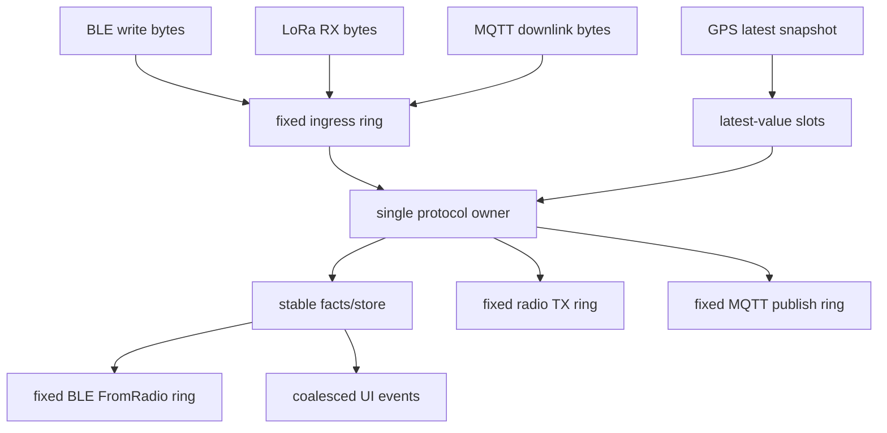
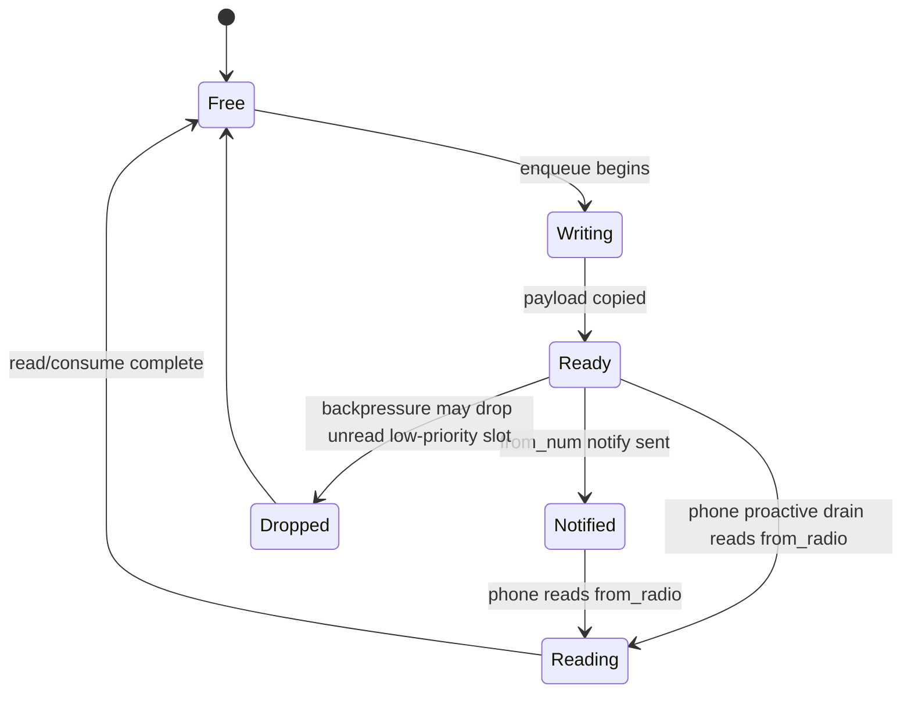
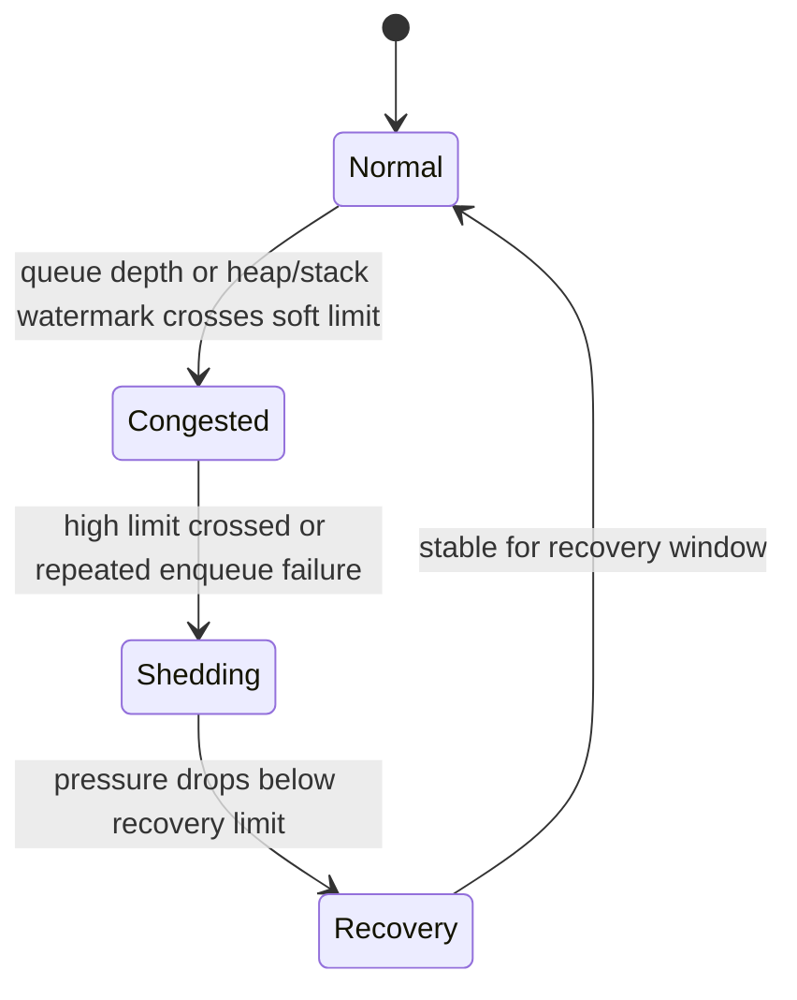
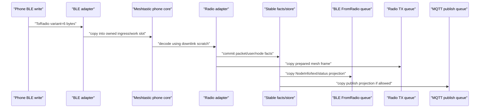
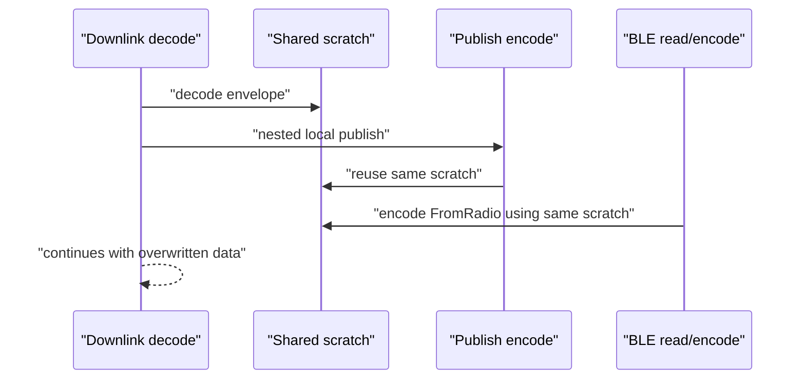

# Meshtastic Protocol Bridge Memory Model

本规格定义 Trail Mate 在 Meshtastic BLE / MQTT / LoRa / UI / GPS 交错运行时的
内存所有权模型。它不是 C++ 标准里的 atomic memory model，而是固件协议桥的
crash-prevention 规格：一块内存由谁拥有、可以活多久、什么时候可以复用、哪些
路径允许丢弃、哪些路径绝不能借用短生命周期数据。

目标很明确：

```text
宁可丢低优先级投影，也不能 crash。
宁可降低吞吐，也不能让共享 buffer、队列 slot 或 callback stack 进入未定义状态。
```

本规格适用于 ESP32、nRF52、Linux simulator/test runtime。平台可以选择不同容量和
阈值，但不能改变 ownership / lifecycle / backpressure 的语义。

## Relationship To Existing Specifications

并发入口、线程/任务边界见 `RUNTIME_CONCURRENCY_SPEC.md`。

Meshtastic Android App 的 BLE 连接、`ToRadio` / `FromRadio` / `FromNum`
drain、配置快照、response-drain-before-save 规则见
`MESHTASTIC_ANDROID_BLE_CONNECTION_SPEC.md`。

Meshtastic 协议业务规则 owner 见 `MESHTASTIC_PROTOCOL_POLICY_SPEC.md`。

跨平台协议行为一致性见 `PROTOCOL_ADAPTER_PARITY_SPEC.md`。

本规格只定义内存所有权、生命周期、队列背压和 scratch 复用规则。它不重新定义
Meshtastic 协议业务语义。

## Core Distinctions

### Memory Capacity vs Memory Ownership

内存容量问题是“系统还能不能放下更多对象”。PSRAM、较小队列、减少 cache 可以缓解。

内存所有权问题是“A 还在使用一块 buffer，B 已经覆盖或释放了它”。PSRAM 不能修复
这个问题。

因此以下问题必须按 ownership defect 处理，而不是按 RAM 不足处理：

- published BLE `FromRadio` slot 在手机读取前被覆盖；
- queue item 保存了 stack local、callback buffer 或 scratch 指针；
- MQTT downlink decode 和 MQTT publish encode 复用同一块 scratch；
- BLE callback / radio RX / MQTT handler 在栈上创建大型 protobuf/frame/config 对象；
- 事实层对象借用了投影层或 scratch 的 backing storage。

### Facts vs Projections

事实层是系统对 mesh 世界的稳定记录：

```text
MeshPacket
User / NodeInfo
ChannelSettings
ModuleConfig
local message record
dedup state
pending admin/status action
```

投影层是某个消费者需要的视图：

```text
BLE FromRadio frame
UI message item
MQTT publish envelope
raw MQTT proxy packet
GPS display event
telemetry display event
```

事实层必须稳定拥有自己的数据。投影层可以丢弃、合并或重建。投影层不得成为唯一真相，
也不得把自己的生命周期反向污染事实层。

### Scratch vs Stable Storage

scratch 是单个执行阶段的临时工作台。它只能在 owner 的同步调用阶段内使用。

stable storage 是 queue slot、store、domain object 或持久化 buffer。它可以跨上下文、
跨 callback、跨 event pump step 存活。

禁止把 scratch 当作 stable storage 使用。

## Execution Contexts

以下上下文可能交错运行：

```text
BLE stack callback
BLE notify/read path
radio IRQ / RX poll / TX completion
MQTT downlink handler
MQTT publish handler
protocol worker / app event pump
GPS UART/parser/timer
UI event loop
config save/load task
storage/filesystem callback
```

单核平台也必须按并发系统处理。风险来自 callback 插入、任务切换、事件嵌套和同步
调用链重入，不只来自多核同时执行。

## Object Classes

| Class | Examples | Owner | Lifetime Rule |
| --- | --- | --- | --- |
| External input buffer | BLE write bytes, radio RX bytes, MQTT envelope bytes | SDK/driver/callback | 只在当前 callback 或 poll step 有效；必须复制后才能跨边界使用。 |
| Ingress slot | fixed ring item containing copied bytes | ingress queue | 从 enqueue 到 protocol worker consume 稳定有效。 |
| Protocol fact | MeshPacket, User, NodeInfo, config, local message | shared protocol/domain store | 不得借用 callback、stack 或 scratch storage。 |
| Projection | BLE FromRadio, UI item, MQTT publish envelope | target output queue | 可丢、可合并、可重建；不得反向定义事实层。 |
| Queue slot | BLE/radio/MQTT/UI fixed ring slot | queue owner | slot 发布后，在消费完成前不可覆盖。 |
| Runtime payload bytes | `IncomingPacket.payload`, `SendPacketEffect.payload`, route/update payload | protocol runtime caller/effect consumer | 必须是固定上限的 owned bytes；不得用 hot-path `std::vector` 作为协议事实载体。 |
| Scratch | decode/encode/temp protobuf/log buffer | declaring owner | 不可跨异步边界，不可进入 queue/store，不可嵌套复用。 |

## Canonical Runtime Shape

最安全的运行形态是：callback 只复制和投递事件，复杂协议处理由单一 owner 串行完成。



如果某个平台暂时不能完全收敛到单一 worker，仍必须保持以下不变量：

- callback 不持有跨 callback 生命周期的外部 buffer；
- callback 不在栈上创建大型协议对象；
- queue slot 自己拥有 payload；
- scratch 不跨路径共享；
- published slot 不被覆盖；
- 高压时按优先级丢弃低价值投影。

## Mandatory Invariants

### R1 External Buffers Are Never Borrowed Across Contexts

BLE、radio、MQTT、filesystem、GPS driver 提供的输入 buffer 不得以指针或引用形式进入
queue、store、UI、BLE projection 或 MQTT publish path。

跨上下文传递必须复制到 owner 明确的 storage：

```text
callback buffer -> ingress slot bytes
decode scratch -> fact/store owned fields
projection scratch -> output queue slot bytes
```

### R2 Queue Slots Own Their Payload

协议桥 queue item 必须拥有自己的 payload storage，或拥有清晰的 fixed arena allocation。
禁止 queue item 保存 stack local、callback buffer、scratch buffer 的指针。

非法形态：

```cpp
queue.push({.payload = scratch.data(), .len = scratch_len});
```

合法形态：

```text
slot.bytes[0..len] contains an owned copy
slot.len records copied length
slot.metadata records immutable routing/projection metadata
```

### R3 Published BLE FromRadio Slots Are Stable Until Consumed

BLE `FromRadio` queue 必须遵守以下生命周期：



`Ready`、`Notified` 和 `Reading` 状态的 slot 不得被覆盖。`from_num` notify 是唤醒信号，
不是读取许可或所有权边界；Meshtastic Android app 会在写 `ToRadio` 后主动 drain
`from_radio`，因此已经编码到 slot 的 frame 必须可以被 proactive read 消费。队列满时只能
丢弃允许丢弃的 unread low-priority slot，或拒绝新的低优先级 projection。

每个 encoded `FromRadio` slot 必须携带由 `MeshtasticPhoneCore` 产生的 immutable
projection metadata：

```text
kind     = config | liveness | queue_status | admin_response | node_info | packet | mqtt_proxy
priority = P0 | P1 | P2 | P3
```

这些 metadata 是发布/背压语义，不是新的协议事实。transport 可以按 metadata 选择保留、
延迟、丢弃或记录日志；transport 不得为了判断重要性重新解析 `FromRadio` protobuf，也不得
用 `from_num`、payload 长度、是否已 notify 等传输痕迹反推出 frame 类型。

### R4 Hot Paths Do Not Allocate Large Automatic Objects

以下路径不得创建大型 automatic local：

```text
BLE write/read/notify callbacks
radio RX/TX hot path
MQTT downlink/publish hot path
config save/load task hot path
GPS/UI cross-context handoff
```

禁止对象包括但不限于：

```text
MeshtasticBleFrame
full protobuf/nanopb config structs
meshtastic_Data / MeshPacket work structs
large uint8_t or char arrays
large std::string temporary assembly
std::deque node allocations in hot path
```

这类对象必须进入 member scratch、fixed queue slot、static storage with declared owner，
或 caller-provided output storage。

BLE `ToRadio` 输入 bytes 是一次执行参数，不是长期协议状态。桥接层可以在
`handleToRadio()` 阶段把它 decode 到 owner 明确的 scratch，但不得保留完整的
“last ToRadio” 影子副本，除非这份副本有显式消费者和声明过的生命周期。debug trace、
未来便利性或“也许以后有用”都不是合法 owner。

### R5 Scratch Is Stage-Local And Non-Reentrant

scratch 必须按用途分区。至少应区分：

```text
downlink_decode_scratch
radio_rx_decode_scratch
radio_tx_scratch
mqtt_publish_scratch
ble_encode_scratch
config_io_scratch
log_hex_scratch
```

禁止一个 `mqtt_scratch_` 同时服务：

```text
handleMqttProxyMessage()
injectMqttEnvelope()
queueMqttProxyPublish()
queueMqttProxyPublishFromWire()
BLE FromRadio encode
```

原因是 MQTT downlink inject 过程中可能同步触发 local RX、MQTT publish 和 BLE
projection。共享 scratch 会在嵌套路径中被覆盖。

### R6 Runtime Queues Are Bounded

协议桥运行期 queue 必须固定容量，并声明 overflow policy。禁止在 ESP/nRF 热路径中引入
无界 `std::deque`、无界 `std::vector` 增长或 fallback heap allocation。

每个 queue 必须回答：

```text
who writes
who reads
when a slot becomes published
when a slot may be reused
what happens when full
which priorities may be dropped
```

### R6.1 Runtime Ingress And Effects Use Bounded Owned Bytes

`IProtocolRuntime` 边界上的 payload/path/public-key bytes 是稳定事实与平台投影之间的
交接面。它们必须使用固定容量的 owned storage：

```text
IncomingPacket.payload      <= protocol payload cap
IncomingPacket.path         <= protocol path cap
SendPacketEffect.payload    <= protocol payload cap
UpdatePeerRouteEffect.key   <= protocol public-key cap
UpdatePeerRouteEffect.bytes <= protocol payload cap
```

平台适配器从 LoRa/MQTT/BLE decode scratch 构造 `IncomingPacket` 时，必须检查 bounded
copy 是否成功。失败语义是 fail-closed：

```text
copy ok     -> call runtime
copy failed -> drop this runtime projection, log/counter, do not call runtime with empty payload
```

这条规则有意把 “payload 过大” 和 “空 payload” 区分开。空 payload 可以是合法协议事实；
copy 失败后的空 buffer 不是事实，不能继续流入 runtime handler。

### R6.2 App-Facing Incoming Queues Use Fixed Slots

`MeshIncomingText` / `MeshIncomingData` 是 app/UI/adapter 边界上的投影 DTO。它们可以在
消费边界恢复成 `std::string` / `std::vector`，但 hot path 入队阶段不得依赖
`std::queue<MeshIncoming*>`、`std::deque<MeshIncoming*>` 或运行期 heap 扩容。

所有实现 `IMeshAdapter::pollIncomingText()` / `pollIncomingData()` 的协议适配器都必须共用
同一套 app-facing incoming queue 规则。当前至少包括 Meshtastic、MeshCore、RNode 和 LXMF：

```text
RX/decode buffer -> fixed incoming queue slot owns copied text/payload bytes
fixed incoming queue slot -> pollIncoming*() restores MeshIncoming* DTO for consumer
```

队列满时必须使用统一优先级背压规则。P1 用户消息和 NodeInfo/User 相关投影应尽量保留；
P2/P3 投影不得挤掉 P0/P1。平台只允许调整 slot 数量和 payload 上限，不允许重新实现一套
不同语义的旁路队列。

BLE app-facing frame queues 也必须遵守同一规则。MeshCore / Meshtastic BLE service 的
RX、TX、offline message frame 都是 projection frame：

```text
BLE callback bytes -> fixed RX frame slot -> command handler -> slot released
protocol response  -> fixed TX frame slot -> notify ok       -> slot released
offline message    -> fixed offline slot  -> pop/copy ok     -> slot released
advert/hash dedup  -> fixed small table, oldest hash evicted when full
active connection  -> fixed small table, expired/oldest slot reused when full
```

队列满时可以丢弃最旧的普通 projection frame，并记录日志/counter；不得在 BLE callback 中
通过 `std::deque` 或 heap 扩容来吸收压力。读取方 buffer 不足时不得释放 offline slot。
BLE service 内部的 advert 去重和 active connection keepalive 也是运行期投影状态，必须使用
固定小表；它们不能通过 vector push/erase 在连接或 advert 高频阶段触发 heap 分配。

共享 phone core 内部的 BLE TX frame queue 也属于同一类 projection queue。它可以使用
平台 profile 定义的固定深度，但不得用 `std::deque<MeshCoreBleFrame>` 在命令处理期间扩容。
协议上有固定最大长度的命令累积区，例如 MeshCore SIGN_DATA 的 8KiB buffer，必须使用固定
owned storage 和长度计数；不得在 BLE 命令流中通过 `reserve()` / `insert()` 逐步扩容。

### R6.3 Protocol Runtime Effects Use Caller-Owned Fixed Batches

`ProtocolEffects` 是协议 runtime 把“事实处理结果”交给适配器执行的动作批次。它不是
事实层存储，也不是平台私有投影队列；ESP、nRF 和 Linux 必须共用同一套批次语义。

规则：

```text
adapter/facade-owned ProtocolEffectWorkspace
    -> runtime handler writes effects into workspace.primary
    -> adapter executor consumes workspace.primary
    -> tx feedback writes at most one action result into workspace.feedback
```

`ProtocolEffects` 不得使用 hot-path `std::vector` / `std::deque` 或运行期 heap 扩容吸收
压力。批次满时必须设置显式 overflow 状态，调用者可以选择延期、丢弃低价值投影或记录
counter，但不得继续分配 emergency buffer。

`ProtocolEffects` 也不得作为 hot-path by-value 返回对象在 runtime/facade 之间传递。
`ProtocolEffect` 的最大 variant 包含 owned payload/public-key bytes，固定 8-slot batch
在 32-bit 目标上约为数 KiB；把它放进每个 runtime handler 的自动局部变量，会把 heap
风险转换成 stack/temporary 风险。正确边界是：调用方或长期存在的 adapter/runtime UI
对象持有 `ProtocolEffectWorkspace`，runtime handler 只向传入 batch 写入动作。

批次容量必须按“正常同步处理 burst”设计，而不是按无限 backlog 设计。批量 ACK timeout
这类可延期投影在 batch 满时必须保留尚未消费的 pending fact，等待下一轮 tick 继续输出；
不得先删除 pending fact 再因为 effect batch 满而静默丢失结果。

`MeshProtocolFacade` 不得自带 fixed batch 成员再被栈上临时构造；它必须引用外部
`ProtocolEffectWorkspace`。该 workspace 只允许一个完整主 batch；TX feedback 线必须使用
专用 1-slot batch，因为当前 runtime 对一次 TX 结果最多只产出一个 action result。平台
adapter 和 embedded UI runtime 必须把 workspace 作为成员或其他明确 lifetime 的 owned
storage；Linux/测试可以使用局部 workspace，但仍必须显式注入。

### R6.4 Protocol Runtime Pending State Uses Fixed Tables

协议 runtime 内部的 pending 状态也是 hot path 状态，不允许通过 `std::deque` /
运行期扩容 `std::vector` 保持未来状态机所需的信息。

当前规则：

```text
pending app ACK       -> fixed slot table, full table drops oldest with explicit Failed effect
packet history/dedup  -> fixed slot table, TTL prune + declared oldest/drop-first policy
pending retransmit    -> fixed slot table, slot owns wire bytes until terminal state
```

这些状态不是 UI 投影；它们会影响 ACK、去重、fallback retransmit、observed relay 和
消息是否被再次转发。满表时可以按声明规则丢弃低价值/最旧状态，但不得隐式分配 heap，
也不得保存指向 scratch 或临时 decoded packet 的引用。

### R6.5 Route / Identity Runtime State Uses Fixed Tables

协议适配器内部的路由、身份、公钥验证状态也是运行期事实缓存。它们不属于 UI 投影，
也不能用 hot-path `std::vector` 扩容来记录未来发送、解密、显示身份或 key verification
需要的状态。

当前规则：

```text
peer route cache          -> fixed slot table, TTL prune + oldest-drop when full
verified peer state       -> fixed slot table, oldest-drop when full
persisted public-key save -> fixed member scratch, newest-seen entries retained
Meshtastic PKI key table  -> fixed slot table, oldest-seen eviction when full
Meshtastic node runtime   -> fixed slot table, oldest-touch eviction when full
```

这些表可以按平台 profile 调整容量，但必须保留同一语义：route slot 自己拥有 path、
pubkey、advert 和候选路径；verified slot 自己拥有 NodeId；持久化保存不得为了排序或筛选
临时构造无界 vector。满表时只能按已声明的最旧/过期规则释放 slot，不得在 RX/TX 或配置保存
路径中触发隐式扩容。

Meshtastic `node runtime` 目前只允许承载最近通道和 nodeinfo reply 节流时间这类
协议运行期索引；只有写入、没有读取的“状态影子”必须删除，不能搬进固定表里伪装成事实。
PKI key table 的 slot 自己拥有 32B public key 和最近看到时间；保存到持久化层时使用
成员 staging 数组，而不是在热路径或保存路径临时构造可增长列表。ESP 和 nRF 必须共享
这套规则，只允许容量因平台 profile 不同而不同。

### R7 Sensor And UI Streams Are Coalesced

GPS、battery、telemetry、UI invalidation 默认是 latest-value 或 coalesced stream。

它们不得以“每个采样都必须排队处理”的形式挤占 BLE/MQTT/LoRa 主协议桥资源。

GPS high pressure rule:

```text
latest wins
old samples may be skipped
UI updates may be delayed
protocol bridge memory must not be blocked by GPS history
```

### R8 Fail Closed On Decode/Encode/Queue Failure

失败后必须丢弃当前 item 或保留已提交事实，不得继续使用半初始化对象。

```text
decode failed -> drop input slot, release storage, increment counter
encode failed -> drop projection, keep already committed facts
queue full -> apply declared drop policy, never allocate emergency heap buffer
config save busy -> coalesce dirty state, never recursively save
```

禁止失败后继续使用 `len`、partially decoded protobuf、过期 pointer 或临时 fallback buffer。

### R9 Platform Profiles May Change Capacity, Not Semantics

ESP32、nRF52、Linux 可以选择不同 queue depth、slot count、scratch placement 和 drop
threshold。它们不能改变以下语义：

- queue slot ownership；
- published slot stability；
- scratch non-reentrancy；
- fact/projection boundary；
- priority-based backpressure；
- MQTT downlink / BLE projection / NodeInfo projection 的共享规则。

## Backpressure Policy

当资源紧张时，系统必须进入有序降级，而不是继续扩容或阻塞主协议桥。



### Priority Classes

| Priority | Meaning | Examples | Drop Rule |
| --- | --- | --- | --- |
| P0 | Session liveness / required responses | BLE pairing/auth/session responses, admin/config response, active send status/ACK, response-drain-before-save state | 不得因普通背压丢弃；若无法保留，必须进入 explicit failure state。 |
| P1 | User-visible protocol facts | text message, direct message, node/user identity needed by app display, routing error/status, channel/config snapshot | 尽量保留；可延迟，不应被 P2/P3 挤掉。 |
| P2 | Latest-value or coalescible data | GPS position, telemetry, battery/status heartbeat, repeated NodeInfo/User, map/report | 可丢旧保新，可合并。 |
| P3 | Diagnostic or raw projection | raw MQTT proxy envelope for phone, duplicate packets, stale UI refresh, debug/log projection, old broadcast metadata | 高压优先丢弃。 |

P3 是最先被丢弃的压力释放层，但不是永久饥饿层。对于 MQTT proxy 这类承担
device->phone->broker 转发职责的 P3 projection，`SendPackets` 阶段必须有 bounded
fairness：在没有 P0/P1 和 deferred side effect 的前提下，连续让路给 P2/P3 若干次后，
可以交付一个 pending MQTT proxy frame。这个规则不改变 drop order；它只防止 strict
priority 在持续低优先级流量下把 MQTT 上下行实际饿死。

### Drop Order

高压时按以下顺序释放压力：

1. 丢弃 P3 unpublished projection。
2. 合并 P2 latest-value stream，只保留最新值。
3. 丢弃重复 P2 projection，例如同 node 的旧 telemetry / NodeInfo projection。
4. 延迟 UI refresh、GPS display update、diagnostic log projection。
5. 拒绝新的低优先级 input，并记录 counter。
6. 只有在 P0/P1 也无法保留时，进入 explicit failure state；不得 silent corruption。

## Pending TX / ACK Wire Slots

radio retransmit、implicit ACK 观察、pending ACK retry 都属于 pending wire ownership。
它们保存的不是临时投影，而是未来可能再次发送或完成状态机所需的完整 wire packet。

因此这些对象必须使用 fixed slot table：

```text
slot.key = packet id / from+packet id
slot.priority = P0/P1/P3
slot.wire[] owns copied packet bytes
slot.metadata owns retry/ack/routing metadata
```

禁止使用 `map<id, vector<uint8_t>>`、`deque<vector<uint8_t>>` 或运行期扩容容器保存
pending wire。平台可以选择不同 slot count 和最大 wire 长度，但不能改变以下规则：

- P0 active local ACK/status 不得被普通压力挤掉；若满表且无法保留，必须显式失败并上报状态。
- P1 retransmit/fallback 可以保留，但不得挤掉 P0。
- P3 observe-only / duplicate metadata 是最先丢弃的 pending wire。
- slot 中的 wire bytes 在 pending 状态结束前不可被 scratch 或新包覆盖。

## MQTT Downlink Ownership Flow

MQTT downlink 是本规格的关键压力路径。正确生命周期如下：



Forbidden flow:



这种错误在低压力下可能只表现为 sender 错误、`???`、消息消失或未读状态异常；在高压力下
可能表现为 GPS corrupt、HardFault、assert、stack canary 或无日志重启。

## Platform Profiles

### nRF52 Profile

nRF52 是最严格 profile：

```text
small fixed BLE FromRadio queue
small MQTT proxy queue
latest-value GPS/telemetry
coalesced UI refresh
no large automatic protocol objects
no unbounded STL hot-path queues
aggressive P2/P3 shedding
explicit counters for dropped projections
```

### ESP32 Without PSRAM Profile

无 PSRAM ESP32 与 nRF52 共享相同 ownership 规则，可以使用略大的容量，但不得放宽
hot-path stack 和 queue bound 约束。

### ESP32 With PSRAM Profile

带 PSRAM 的 ESP32 可以把大型 cache、字体、地图、pack、较大 projection queue 放入 PSRAM。

PSRAM 不允许用来绕过以下规则：

- 不允许 published slot 被覆盖；
- 不允许 queue 保存 scratch pointer；
- 不允许 callback 栈承担大对象；
- 不允许 downlink/publish/BLE encode 共享同一 scratch；
- 不允许平台私有规则改变协议行为。

### Linux Profile

Linux 可以使用更大的 queue 和 heap allocation，但测试语义必须与固件一致。Linux 不能因为
资源宽松而隐藏 ownership defect。共享测试应覆盖 queue full、drop policy、slot stability
和 scratch reentrancy 的语义。

## Required Checks

任何触碰以下区域的改动都必须回归本规格：

```text
BLE Meshtastic bridge
MeshtasticPhoneCore
ESP/nRF Meshtastic radio adapter
MQTT downlink/publish bridge
FromRadio/FromNum queue
NodeInfo/User projection
GPS/UI cross-context handoff
config save/load async path
```

Review 必须检查：

- 是否新增了 hot-path 大 automatic local；
- 是否新增无界 queue 或隐式 heap fallback；
- queue item 是否拥有 payload；
- published slot 是否可能被覆盖；
- scratch 是否被多个嵌套路径复用；
- P0/P1 是否可能被 P2/P3 挤掉；
- 平台是否只改变 profile 容量，而没有改变共享语义。

ESP stack hygiene 检查仍然适用。该脚本是守门工具，不是本规格的替代品。

## Anti-Patterns

以下形态默认视为 defect：

```text
callback directly decodes and mutates app services
queue stores pointer into scratch or stack
published BLE slot overwritten before phone read
single shared scratch used by downlink and publish
GPS/UI telemetry events accumulated without bound
std::deque introduced into ESP/nRF hot path
protobuf/config/frame object allocated on callback stack
decode failure continues with partial object
platform branch silently changes MQTT/NodeInfo/BLE projection rule
raw MQTT proxy projection allowed to starve text/admin/status
```

## Implementation Admission Checklist

进入实现前，必须先回答：

1. 这个改动改变的是事实层、投影层、queue、scratch，还是平台 profile？
2. 新对象的 owner 是谁？
3. 这个对象是否跨 callback、跨 task、跨 event pump step 存活？
4. 如果跨边界，是否复制到了 stable storage？
5. 如果 queue 满了，丢弃策略是什么？
6. 如果 decode/encode 失败，是否 fail closed？
7. nRF、无 PSRAM ESP、带 PSRAM ESP、Linux 是否仍遵守同一语义？
8. 是否需要更新 `MESHTASTIC_ANDROID_BLE_CONNECTION_SPEC.md`、`PROTOCOL_ADAPTER_PARITY_SPEC.md`
   或共享 policy/test？

## Non-Negotiable Summary

```text
External input is short-lived.
Queue slots own copied bytes.
Published BLE frames are stable until consumed.
Facts are stable; projections are lossy.
Scratch is stage-local and never escapes.
Hot paths do not allocate large automatic objects.
Runtime queues are bounded.
Sensors and UI coalesce under pressure.
Failures drop or degrade explicitly; they never continue with partial state.
Platform differences tune capacity only; they do not change ownership semantics.
```
