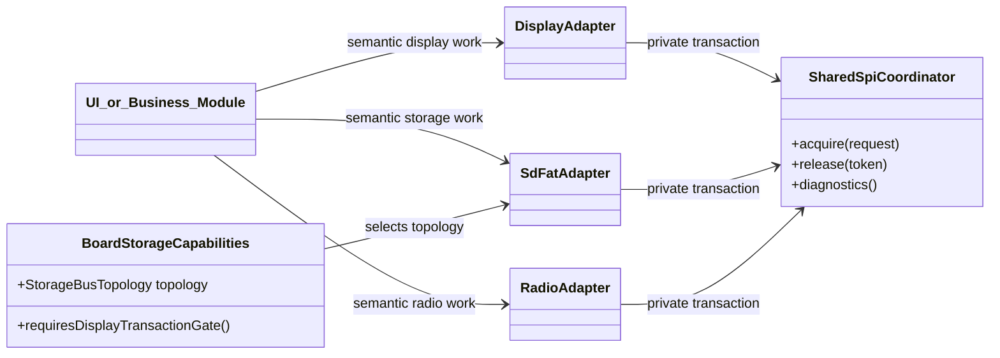
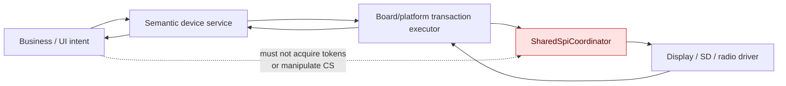

# Shared SPI Bus Architecture Specification

## Status, authority, and reading order

This is the normative top-level specification for Trail Mate's shared-SPI
mechanism. It defines the hardware-resource boundary; product specifications
for map, chat, storage, localization, tracking, team, USB, and radio consume
semantic device results and must not restate locking, token, priority, or
deadline rules.

The specification set is deliberately split by responsibility. A change is
complete only when the relevant implementation, its focused specification, and
the [board conformance record](./SPI_BUS_BOARD_CONFORMANCE.md) agree.

| Read this document | To answer |
| --- | --- |
| [Coordinator](./SPI_BUS_COORDINATOR_SPEC.md) | Who can own the bus, in what order, and how ownership is released |
| [LVGL display](./SPI_BUS_DISPLAY_LVGL_SPEC.md) | When an LVGL buffer may be released and how a deferred frame resumes |
| [Storage recovery](./SPI_BUS_STORAGE_RECOVERY_SPEC.md) | How SD traffic, mount, reset, power-cycle, and frequency fallback are isolated |
| [Startup lifecycle](./SPI_BUS_STARTUP_LIFECYCLE_SPEC.md) | What the first-frame and wake gates actually prove |
| [Board conformance](./SPI_BUS_BOARD_CONFORMANCE.md) | Which boards physically share a bus and their exact device/CS obligations |
| [Verification and observability](./SPI_BUS_VERIFICATION_AND_OBSERVABILITY_SPEC.md) | What to measure and test before declaring the mechanism conformant |

The code anchors in this suite are repository-relative links, so the documents
remain useful both in GitHub and in a local checkout. They identify the current
implementation, not an alternative authority: when code and this specification
disagree, the code is non-conformant until the specification is consciously
revised.

## Scope and physical topology

The mechanism is selected from physical wiring, never from a product feature or
an historical board-name list.

The current topology contract is:

| Target family | Physical relation | Coordinator rule |
| --- | --- | --- |
| T-LoRa Pager, T-Deck, T-Deck Pro | Display, SD, and LoRa share Arduino SPI | One coordinator for that physical bus; SD uses the shared-SPI SdFat adapter |
| T-Display P4 | SDMMC for SD and a separate SPI path for LoRa | SDMMC does not acquire the shared-SPI coordinator |
| Independent future buses | No shared electrical controller | Use the native driver or an API-compatible no-op backend; never hide a second locking model |

`BoardStorageCapabilities` and its `StorageBusTopology` selection are the
code-level topology boundary in
[board_runtime.cpp](../../platform/esp/boards/src/board_runtime.cpp).

## Normative invariants

1. **One physical bus has one coordinator.** `SharedSpiCoordinator` is the
   sole serialized ownership gate. Its internal metadata critical section is
   not a second feature-level SPI mutex.
2. **Only device/platform owners acquire it.** Business modules and UI-facing
   headers never expose coordinator types, tokens, policies, chip-select pins,
   or private filesystem guards.
3. **A grant owns exactly one hardware-safe transaction.** The owner releases
   before parsing, allocation, UI updates, compression, protobuf work, or
   other long software work. A finite `RecoveryExclusive` SD session is the
   explicit exception: its reset, peer-CS fence, bounded settle delays, and
   candidate attempts are one hardware-recovery transaction because releasing
   the fence between them would expose a partially reconfigured controller.
4. **Display completion is transactional.** LVGL may release a pixel buffer
   only after that same buffer has reached a `Completed` display transaction.
   A lock timeout is not a completed frame.
5. **Storage sessions and bus transactions are distinct.** SdFat object
   lifetime may be serialized privately, but the physical bus is acquired at
   hardware transaction boundaries and released between eligible sectors.
6. **Recovery is exclusive and board-aware.** SD reset/frequency fallback may
   manipulate peer CS pins only while the recovery owner holds the coordinator.
7. **Evidence names must be honest.** A write-only panel can prove only
   `display_transaction_completed` (bus granted and driver returned after
   issuing the write), never physical pixel presentation.
8. **The first boot frame and wake redraw use the normal display contract.**
   Synchronous scheduling may call LVGL, but it cannot bypass the display
   result or manufacture completion evidence.

## Layer boundary

The private implementation vocabulary includes `SharedSpiCoordinator`,
`BusAccessPolicy`, acquire request/result/status, tokens, owner labels,
`PersistenceBusGate`, SdFat session guards, and CS identities. Semantic
results crossing a device boundary are values such as `Completed`,
`RetryLater`, `Missing`, `Unavailable`, and `Failed`.

## Scheduling model

The coordinator orders waiting transactions by declared class, deadline, and
age. The detailed mapping from the desired semantic classes to current
`BusAccessPolicy` values, timeout budgets, nesting, and release checks is in
the [coordinator specification](./SPI_BUS_COORDINATOR_SPEC.md).

At a minimum:

- a frame already accepted by the LVGL flush callback has highest display
  urgency;
- an active radio command/IRQ transaction cannot be bypassed by background
  storage;
- a foreground user operation outranks maintenance;
- an existing hardware-safe transaction may finish, but the next grant must
  not choose a lower class while an older/higher eligible waiter exists;
- a health warning never creates an undisclosed feature cooldown or changes
  the global order.

## Memory and DMA boundary

Shared-SPI correctness includes the buffer around a transaction:

- Long-lived and reusable application scratch storage should prefer PSRAM
  where appropriate; DMA, cache, semaphore, and driver objects remain in
  internal memory when required by the hardware or SDK.
- ESP hot paths must not create protocol-sized automatic locals. Use owned
  member scratch storage, a fixed-depth slot with explicit ownership, or
  caller-owned output storage.
- A physical transaction holds a large buffer only for as long as the driver
  genuinely needs it. Encoding, decoding, parsing, and allocation occur before
  acquisition or after release.
- Display initialization must not allocate a full RGB framebuffer merely to
  clear a panel. The Arduino SPI adapter uses a two-byte RGB565 pattern with
  `SPIClass::writePattern()`; panel-specific persistent surfaces (such as the
  T-Deck Pro's monochrome EPD surface) are board-owned and are not duplicated
  by the LVGL bridge.
- The LVGL display buffer is exceptional: on `Busy` or `Unavailable`, it stays
  owned by LVGL's unfinished flush until the exact transaction completes; see
  the [LVGL display specification](./SPI_BUS_DISPLAY_LVGL_SPEC.md).

## Conformance and terminology

This specification defines the target mechanism. Current implementation
conformance is recorded explicitly rather than implied:

| Area | Current assessment | Required closure |
| --- | --- | --- |
| One coordinator and token ownership | Substantially implemented | Retain it; do not add a retry mutex or task-local arbiter |
| LVGL busy-buffer ownership | Implemented; verification pending | Retained transfer plus LVGL wait callback; prove it with the forced-Busy target test |
| T-Deck Pro EPD result propagation | Implemented; verification pending | Return `Busy` when EPD ownership was not acquired; prove complete only after the EPD target test |
| T-Deck Pro token wrapper | Compatibility bridge implemented; verification pending | It has no physical mutex and forwards invalid/cross-task releases to coordinator diagnostics; preserve that behavior if the legacy paired API is removed |
| Pager SD recovery peer isolation | Implemented; verification pending | Separate unfenced power-cycle peers from the recovery peers passed to the coordinator-held helper |
| Startup wording and evidence | Implemented; verification pending | Storage gate reads `displayFrameCompletions()`, while UI logs describe only presentation attempts; use `display_transaction_completed`, not `physical_present` |
| Radio policy | Explicitly mapped | Radio command/IRQ work uses `InteractiveWorkerBounded` (priority 1, effective maximum acquire wait 200 ms); do not invent a board-local class |

The board conformance table is a release gate, not a retrospective note. A
target may not be marked conformant merely because it builds.

## Change-control rules

Any change that touches a shared-SPI display adapter, board SD recovery,
coordinator policy, radio transaction, or startup gate must:

1. update the focused specification in this set if its behavior changes;
2. identify affected board rows in the conformance table;
3. run an impact analysis before editing the affected symbol;
4. add or update the proof named by the verification specification; and
5. keep direct SPI calls within the documented platform/device boundary.

Feature documents may link here but must not fork a local copy of these rules.
