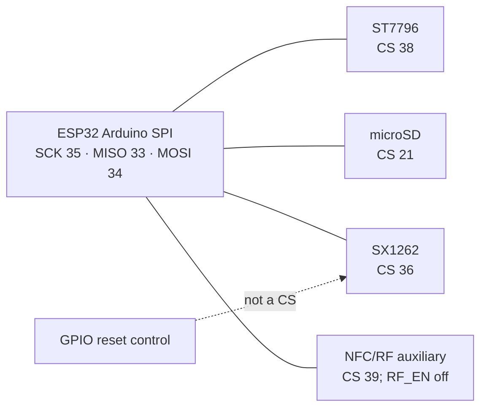
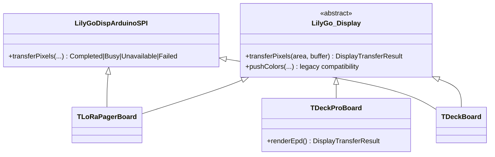

# Shared SPI Board Conformance Specification

## Purpose

This is the board-level release gate for the shared-SPI specification set. It
records physical topology, peer-isolation duties, and the evidence required to
call a target conformant. It prevents a generic adapter change from silently
assuming the Pager's, T-Deck's, and T-Deck Pro's wiring are interchangeable.

The authoritative mechanism remains
[SPI_BUS_ARCHITECTURE_SPEC.md](./SPI_BUS_ARCHITECTURE_SPEC.md); this document
does not create a second scheduler or board-local policy.

## Current topology matrix

| Target | Shared peripherals | Storage topology | Display adapter path | Recovery peer declaration | Status |
| --- | --- | --- | --- | --- | --- |
| T-LoRa Pager | ST7796 display, SD, SX1262 LoRa; NFC/RF auxiliary physically shares lines but is intentionally unpowered | `SharedDisplaySpi` | `LilyGo_Display` + `LilyGoDispArduinoSPI` | Separate LoRa-only pre-power-cycle peers and LoRa+display recovery peers | Implementation complete; target verification pending |
| T-Deck | Display, SD, LoRa | `SharedDisplaySpi` | `LilyGo_Display` + `LilyGoDispArduinoSPI` | LoRa + display CS supplied to common helper | Implementation complete; target verification pending |
| T-Deck Pro | EPD, SD, LoRa | `SharedDisplaySpi` | Custom `LilyGo_Display` EPD render path; RAM page rasterization is outside a lease and each `nextPage()` submission is fenced | LoRa + EPD CS and explicit SCK/MISO/MOSI transport supplied to common helper | Implementation complete; target verification pending; compatibility token mirror forwards release mismatches to coordinator |
| T-Display P4 | SDMMC SD; LoRa on distinct SPI path | `Sdmmc` | Independent from shared display storage gate | Not applicable to SDMMC | Outside shared-SPI SD coordinator |

Only a board actually listed as `SharedDisplaySpi` enters this mechanism. A
board that has a SPI display but electrically independent SD must not join a
coordinator merely for API symmetry.

## T-LoRa Pager electrical conformance

The Pager schematic supplied with the project identifies the shared Arduino
SPI signals as SCK GPIO35, MISO GPIO33, and MOSI GPIO34. The relevant selected
devices are:

| Device | CS / control | Required state during SD recovery |
| --- | --- | --- |
| ST7796 display | `DISP_CS` GPIO38 | CS inactive only after recovery fence is owned |
| SD card | `SD_CS` GPIO21 | CS inactive before reset, then selected only by SdFat transaction |
| SX1262 LoRa | `LORA_CS` GPIO36 | CS inactive under recovery fence |
| LoRa reset | `LORA_RST` | A reset control, **not** a CS member |
| NFC/RF auxiliary | CS GPIO39, power gated by expander RF enable | Leave power disabled; do not invent an active CS participant without a product feature |

Relevant code anchors:

- Pager CS/reset initialization:
  [initShareSPIPins](../../boards/tlora_pager/src/tlora_pager_board.cpp)
- Pager power-cycle and mount sequence:
  [installSD](../../boards/tlora_pager/src/tlora_pager_board.cpp)
- Generic reset/fallback helper:
  [sd_utils.h](../../platform/shared/include/board/sd_utils.h)

The source is the supplied LilyGO schematic; board code must remain aligned
with it. A code list that calls `LORA_RST` a CS list is semantically incorrect
even when the pin's idle level happens to be high.

## Adapter conformance matrix

The typed method exists in the base adapter, Pager, T-Deck, T-Watch S3, and
the T-Deck Pro EPD adapter. Every `LilyGo_Display` subclass used by shared SPI
must forward the same semantic result; a base class must not convert an
unreported hardware attempt into `Completed`.

### T-Deck Pro ownership-wrapper review

The board-local `sharedSpiLock()` / `sharedSpiUnlock()` compatibility functions
call the global coordinator and do not create a second physical mutex. They do
mirror token, task, and nesting state for legacy paired call sites. On an
invalid or cross-task release, the wrapper now forwards its token to the
coordinator; the coordinator records the mismatch and does not unlock another
owner. This makes the coordinator the diagnostic authority as well as the
physical owner.

The mirror remains compatibility state, not a second scheduling policy. New
board code should prefer a scoped coordinator token; any future removal of the
legacy paired interface must preserve the same mismatch visibility. The static
contract check covers the forwarding requirement, while a target trace still
validates the EPD timing path.

## Board-specific acceptance evidence

| Target | Required build/test | Required hardware trace |
| --- | --- | --- |
| Pager | `tlora_pager_sx1262` build; forced-busy LVGL test; recovery-fence test | cold boot, first frame, SD mount and frequency, forced remount while UI redraws |
| T-Deck | target build; typed-result forwarding test; bootstrap RadioLib transaction is coordinator-fenced | first frame under SD background load |
| T-Deck Pro | target build; EPD Busy result test; bootstrap `SPI.begin()` is coordinator-fenced | EPD redraw while SD/radio transaction holds coordinator |
| T-Display P4 | topology guard test | demonstrate SDMMC path never increments shared-SPI display counters |

A build is necessary but insufficient. A target is `Conformant` only when its
typed display completion and any recovery CS manipulation are proven in the
named tests/traces.
