# Shared SPI Coordinator Specification

## Authority and implementation anchors

This document defines ownership, ordering, and diagnostics for the coordinator
named by [SPI_BUS_ARCHITECTURE_SPEC.md](./SPI_BUS_ARCHITECTURE_SPEC.md).
The current interface is
[SharedSpiCoordinator](../../platform/esp/common/include/platform/esp/common/shared_spi_coordinator.h),
which implements the platform-neutral
[IBusArbiter contract](../../modules/core_sys/include/sys/shared_spi_access.h).
Its FreeRTOS implementation is
[shared_spi_coordinator.cpp](../../platform/esp/common/src/shared_spi_coordinator.cpp).

It is normative for every board that physically shares one SPI controller. It
does not permit a board, feature, UI component, or storage worker to introduce
its own mutex, queue, direct unlock, or shadow priority policy.

## Ownership model

```mermaid
stateDiagram-v2
    [*] --> Idle
    Idle --> Waiting: acquire(request)
    Waiting --> Owned: selected by class + age
    Waiting --> TimedOut: deadline expires / waiter pool unavailable
    TimedOut --> [*]
    Owned --> Owned: same task, nested acquire
    Owned --> Owned: release nested token
    Owned --> Idle: release outermost matching token
    Owned --> Mismatch: invalid task / generation / depth / duplicate token
    Mismatch --> Owned: diagnostic only; ownership unchanged
```



An acquired token records the physical resource, command/origin identity,
acquiring task, generation, nesting depth, acquisition time, and validity. A
release is accepted only when all of the following are true:

1. the token is still valid;
2. the releasing task is the acquiring task;
3. the generation matches the current owner; and
4. the token depth is the coordinator's current LIFO nesting depth.

On mismatch the coordinator increments `release_mismatches` and **does not
unlock** another transaction. Same-task nesting is available only for an
already-owned platform transaction; no business caller is allowed to observe
or participate in it.

## Current request-policy map

`BusAccessPolicy` is the implementation vocabulary. Its current priority and
maximum acquisition wait come from `priorityFor()` and `timeoutFor()` in the
implementation anchor above.

| Current policy | Priority (smaller is earlier) | Maximum acquisition wait | Intended use |
| --- | ---: | ---: | --- |
| `UiNeverBlock` | 0 | 0 ms | Nonblocking platform attempt; not a retained display flush |
| `DisplayFrameCritical` | 0 | 45 ms | A frame already accepted by LVGL, including its retry |
| `InteractiveWorkerBounded` | 1 | 200 ms | Foreground device action and current radio operations |
| `DurableCommit` | 2 | 250 ms | Bounded user-requested save/flush |
| `RecoveryExclusive` | 3 | 500 ms | SD mount/recovery fence, not normal I/O |
| `BackgroundWorkerBounded` | 4 | 25 ms | Hydration, compaction, prefetch, and maintenance |

The coordinator has eight waiter slots. It chooses the earliest sequence inside
the highest-priority occupied class, wakes the best waiter after release, and
uses request deadlines to cap each attempt. A currently active transaction is
never forcibly interrupted.

### Radio policy mapping

`InteractiveWorkerBounded` is the shared policy for active radio command and
IRQ transactions. It has priority 1 and an effective maximum acquisition wait
of 200 ms, so it outranks durable and background storage but not a retained
LVGL display frame. This is a deliberate common mapping, not an implicit
`RadioTiming` policy hidden in individual board adapters.

If a future radio requirement needs different ordering or a different bounded
wait, add one global `BusAccessPolicy` value and migrate every radio adapter in
one reviewed change. Adding a board-local radio mutex, policy, or queue is
forbidden.

## Arbitration sequence

```mermaid
sequenceDiagram
    autonumber
    participant O as Device transaction owner
    participant C as SharedSpiCoordinator
    participant W as Waiter slot
    participant H as SPI hardware

    O->>C: acquire(resource, policy, deadline, owner)
    C->>C: reserve waiter and rank all waiters
    alt current task already owns the bus
        C-->>O: nested token (LIFO depth + 1)
    else owner idle and this request is best
        C->>C: record owner/generation/time
        C-->>O: acquired token
        O->>H: one hardware-safe transaction
        O->>C: release(matching outer token)
        C->>C: clear owner, record hold, choose best waiter
        C->>W: wake best waiter
    else deadline expires
        C->>C: clear this waiter; record timeout/health
        C-->>O: Busy or TimedOut; no token
    end
```

`ScopedBusAccessToken` in
[bus_access_scope.h](../../modules/core_sys/include/sys/bus_access_scope.h)
is the expected RAII boundary for C++ transaction owners. Explicit release is
allowed only where the code must release before subsequent non-transactional
work and must preserve the same matching token rules.

## Transaction-size rules

An owner holds the bus from the first hardware configuration that can affect a
peer through the final chip-select/driver completion. It does not hold it while:

- parsing or allocating application objects;
- formatting/printing unbounded logs;
- drawing LVGL layout or looking up fonts;
- processing a radio packet after it has been read;
- updating repositories or publishing UI state; or
- sleeping between independent retry attempts.

`RecoveryExclusive` is narrowly different. A board's SD recovery fence may
cover a finite, declared candidate sequence because its peer CS state and
controller remap are deliberately unsafe to expose between attempts. Its
short 2/10/25 ms settle delays are part of that physical recovery sequence,
not generic work retries. It must still release before result publication,
parsing, UI work, or an unbounded retry/backoff loop.

The coordinator's `maximumHoldMs` is a health diagnostic. It does not make a
long underlying driver operation preemptible. A device adapter must split work
at driver-safe boundaries rather than claiming a deadline that the driver
cannot enforce.

## Diagnostics contract

The current coordinator exposes:

| Metric | Current source | Meaning |
| --- | --- | --- |
| `displayFrameRequests` | `DisplayFrameCritical` acquire attempts | All display acquisition attempts, including retries |
| `displayFrameCompletions` | explicit display integration notification | A display caller reported a completed transaction |
| `displayFrameBusyRetries` | display acquisition timeout, plus legacy notifier | Busy attempts; must never be called a transfer failure |
| `displayFrameFailures` | explicit display integration notification | A started transaction reported a real driver failure |
| `displayFrameDeferrals` | first Busy/Unavailable result for a retained LVGL flush | Number of unique unfinished LVGL flushes |
| `maximumDisplayFrameWaitMs` | completed retained LVGL flush | Largest first-defer to completion duration |
| `releaseMismatches` | rejected releases | Invalid ownership/token protocol use |
| `maximumHoldMs` | outermost release | Largest measured coordinator hold |
| scalar runtime snapshot | coordinator critical section | Current active/policy/held state plus all counters, without returning owner-label pointers |

`displayFrameDeferrals` and `maximumDisplayFrameWaitMs` measure the lifetime
from the first `Busy`/`Unavailable` result until the same retained transfer
completes; they are not approximated from an unrelated LVGL timer cadence.

The full operator-facing model and test proof are in
[SPI_BUS_VERIFICATION_AND_OBSERVABILITY_SPEC.md](./SPI_BUS_VERIFICATION_AND_OBSERVABILITY_SPEC.md).

## Forbidden patterns

```text
feature-local mutex -> physical SPI transaction
direct SPI access outside a device transaction executor
invalid release -> clear owner anyway
timeout -> bypass the queue on the next attempt
board-specific priority rule -> grant lower work ahead of a global waiter
```

## Conformance obligations

Before a coordinator-facing change is complete:

1. impact-analyse every edited coordinator or adapter symbol;
2. preserve strict matching release and same-task LIFO nesting;
3. prove priority order and FIFO-within-class with host tests;
4. prove timeout leaves no waiter/owner leak;
5. expose any newly claimed metric in diagnostics; and
6. update the board conformance record if a target changes topology or policy.
