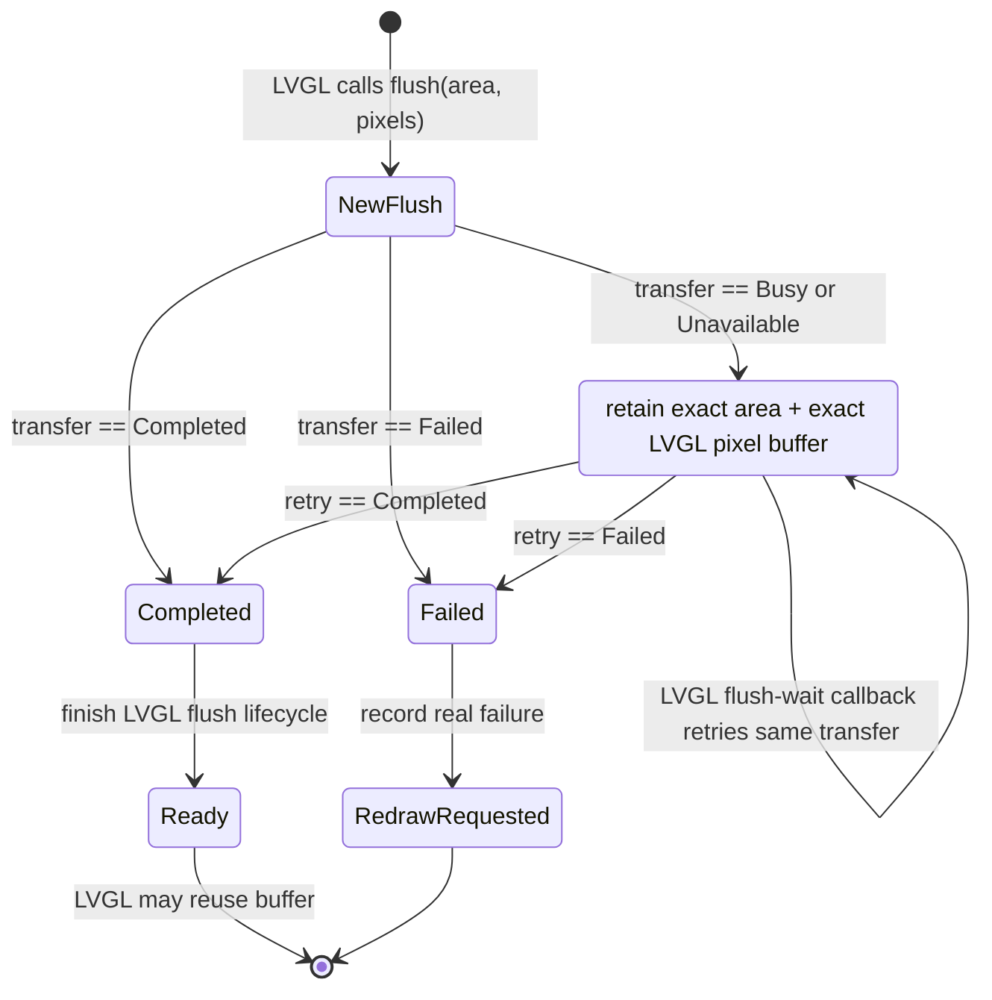

# Shared SPI LVGL Display Transaction Specification

## Authority and code map

This document is the normative buffer-ownership contract for every LVGL display
running over a shared SPI bus. It refines the architecture and coordinator
specifications; a legacy `bool` return or a board-specific drawing shortcut
does not weaken it.

| Layer | Current code anchor |
| --- | --- |
| LVGL integration and flush registration | [LV_Helper_v9.cpp](../../platform/esp/arduino_common/src/LV_Helper_v9.cpp) |
| Display abstraction and legacy success fallback | [DisplayInterface.h](../../platform/esp/boards/include/display/DisplayInterface.h) |
| Arduino SPI display transaction | [DisplayInterface.cpp](../../platform/esp/boards/src/display/DisplayInterface.cpp) |
| LVGL v9 dependency pin | [platformio.ini](../../platformio.ini) (`lvgl/lvgl @ 9.4.0`) |

The resolved LVGL v9 source is audited as part of this contract because its
exact semantics matter: when `flush_wait_cb` is registered, LVGL invokes it
while `flushing` is set and clears that flag immediately after the callback
returns. The callback therefore **must not return after a merely deferred
retry**. The repository pins the dependency above; generated `.pio` files are
not a documentation link target because they are not versioned source.

## Result model

Every display adapter must report one of these semantic transaction results to
the LVGL integration:

| Result | Meaning | LVGL buffer and flush state |
| --- | --- | --- |
| `Completed` | Address window and all pixels for this flush were issued; the driver reported no failure | Finish the flush lifecycle |
| `Busy` | No display transaction started because the bus was not granted in this attempt | Retain the exact area and original LVGL buffer; retry it in the wait callback |
| `Unavailable` | Display or shared-bus initialization is not ready | Retain the same transfer; emit a bounded diagnostic; retry through the wait callback once recovery is possible |
| `Failed` | A non-retryable request validation or driver error; a driver error may occur after a transaction started | Record a terminal failure, then use the explicitly defined failure/redraw path |

`pushColorsResult()` remains a legacy boolean compatibility surface and cannot
carry all of this contract. The typed `transferPixels()` result now sits at the
adapter boundary; legacy void/boolean methods forward to it for non-LVGL
callers. The LVGL bridge calls only the typed API. An invalid pointer or area
is terminal rather than retriable: it may return `Failed` without driving SPI,
because retaining such a request forever would turn an input defect into an
infinite wait. This does not weaken the Busy/Unavailable rule.

## Required flush state machine



There may be at most one pending flush per LVGL display instance because LVGL
does not begin the next flush until the current one becomes ready. The retained
record must be explicit and contain the display instance, display adapter,
area, pixel pointer, first-deferred timestamp, and diagnostics sequence. It
must not copy an arbitrary frame-sized buffer onto an ESP task stack.

## Correct retry sequence

```mermaid
sequenceDiagram
    autonumber
    participant L as LVGL refresh engine
    participant F as Trail Mate flush callback
    participant A as Display adapter
    participant C as Coordinator
    participant P as Display panel

    L->>F: flush(area, original LVGL buffer)
    F->>A: transfer(area, original buffer)
    A->>C: acquire(DisplayFrameCritical, 45 ms)
    alt first attempt is granted
        C-->>A: token
        A->>P: address window + pixels
        A-->>F: Completed
        F-->>L: flush lifecycle complete
    else first attempt is Busy or Unavailable
        C-->>A: no token
        A-->>F: Busy / Unavailable
        F->>F: persist original area + buffer; increment deferred metric
        Note over F,L: No flush_ready and no buffer reuse here
        L->>F: flush_wait_cb(display)
        loop until the same transfer is Completed or truly Failed
            F->>A: transfer(saved area, saved original buffer)
            A->>C: acquire(DisplayFrameCritical)
            C-->>A: retry result
        end
        F-->>L: wait callback returns only after Completed/defined Failed path
    end
```

For LVGL v9, direct `lv_display_flush_ready()` is valid on an immediate
`Completed` path when no wait callback is being relied on. In the wait-callback
path, LVGL clears its flushing state after the callback returns. The invariant
is semantic rather than a particular helper call: **the flush lifecycle becomes
ready only after `Completed`, never on Busy or Unavailable**.

## Why a periodic retry alone is wrong

The normal UI runtime calls `lv_timer_handler()` on a periodic cadence, but
startup also has a synchronous boot presentation path. Retrying only from a
periodic display runtime would miss or duplicate the direct startup route.
LVGL's own flush-wait callback is the common, buffer-owning boundary for both
paths. It also makes the current frame's dependency explicit to LVGL instead
of creating an unrelated background retry task.

The callback may wait through repeated bounded coordinator attempts because
the display frame is already an accepted LVGL transaction. The coordinator
wakes priority waiters on release; no extra mutex, second task, or blind
timer-based frame drop is allowed.

## Board adapter obligations

### Arduino SPI panels (Pager, T-Deck, applicable shared-SPI boards)

`LilyGoDispArduinoSPI::transferPixels()` acquires `DisplayFrameCritical`,
writes the address window and pixels while it holds the token, then releases
it. A denied acquisition returns `Busy`; an uninitialized adapter returns
`Unavailable`; a validation or driver failure returns terminal `Failed`.

### T-Deck Pro EPD

`TDeckProBoard::transferPixels()` writes into its already owned monochrome EPD
surface and returns `renderEpd()`'s typed result. `renderEpd()` returns `Busy`
when `DisplayFrameCritical` acquisition fails, `Unavailable` when no display is
ready, and `Completed` only after the EPD transfer returns. The persistent mono
surface is board-owned; the LVGL bridge adds no duplicate framebuffer. GxEPD2
page-buffer setup and bitmap rasterization are RAM-only work and occur without
a bus lease. Each `nextPage()` hardware submission receives its own
`DisplayFrameCritical` lease with the EPD peer-CS fence; the board may return
`Busy` before a page submission and retry the retained LVGL frame. The pinned
GxEPD2 implementation performs the final EPD power-off inside the final
`nextPage()`, so the board does not issue a redundant second SPI call.

### Legacy compatibility

Existing void `pushColors()` and boolean `pushColorsResult()` methods can stay
as compatibility surfaces for non-LVGL callers. The LVGL bridge must call a
typed result API. No caller may infer `Completed` from a void return.

## Explicitly forbidden paths

```text
coordinator Busy
  -> return false from display transaction
  -> call lv_display_flush_ready()
  -> invalidate a different screen/layer as recovery
```

```text
LVGL flush callback
  -> enqueue background retry
  -> return from flush_wait_cb before the transfer completes
```

```text
board's void pushColors()
  -> fail to acquire SPI
  -> inherited base method returns success
```

The first path was the Pager/T-Deck-class defect in
[disp_flush](../../platform/esp/arduino_common/src/LV_Helper_v9.cpp); the
structural CI check now forbids it. The third was the T-Deck Pro defect in
[TDeckProBoard::renderEpd](../../boards/tdeck_pro/src/tdeck_pro_board.cpp);
the typed result now propagates its `Busy` outcome. Target contention evidence
remains required before either closure is called operationally complete.

## Required measurements and proof

Each deferred frame must contribute exactly once to `deferred_frames`, and its
elapsed time until completion must contribute to `maximum_frame_wait_ms`.
Acquisition attempts remain `frame_requests`; coordinator timeouts remain
`busy_retries`; only a terminal `Failed` result is a `failed_transfer`.
`Busy` and `Unavailable` must never be counted as failure.

Required proof includes forced Busy, normal complete, unavailable-to-ready,
and actual transfer failure cases. The original pointer and area must be
asserted equal at retry time. Full test and operator requirements are in
[SPI_BUS_VERIFICATION_AND_OBSERVABILITY_SPEC.md](./SPI_BUS_VERIFICATION_AND_OBSERVABILITY_SPEC.md).
