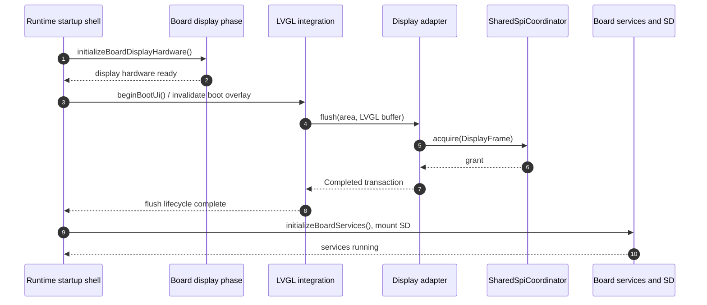

# SPI Bus Startup and Wake Lifecycle Specification

## Authority and purpose

This specification owns the display-first startup and wake lifecycle for
shared-SPI boards. It refines the transaction/evidence rules in
[SPI_BUS_ARCHITECTURE_SPEC.md](./SPI_BUS_ARCHITECTURE_SPEC.md); it does not
grant a separate startup-only SPI lock or an exception to the LVGL flush
contract.

The product promise is a visible, explanatory boot state before slow services
compete for the bus. The technical evidence is deliberately narrower:
`display_transaction_completed` means the coordinator granted the display
transaction and the display driver returned after issuing the write. It is not
evidence that a write-only panel physically rendered those pixels.

## Required lifecycle



If the coordinator initially returns `Busy`, the same diagram continues inside
LVGL's flush-wait callback; LVGL must retain the buffer until `Completed`. The
full branch is defined in
[SPI_BUS_DISPLAY_LVGL_SPEC.md](./SPI_BUS_DISPLAY_LVGL_SPEC.md).

## Ordering rules

1. The Arduino launcher enters through `initializeBoardDisplayHardware()`
   before `beginBootUi()`. A legacy board bootstrap may also perform bounded,
   coordinator-mediated board setup (for example radio or input probing). Its
   controller pin mapping, `SPI.begin()`, any live chip-select manipulation,
   and device traffic must execute only after that coordinator token is
   acquired; it must not mount/recover shared-SPI storage or bypass the
   coordinator. A one-time *passive baseline* that configures a chip-select as
   an output and drives it inactive is allowed before concurrent board tasks
   exist. That baseline must not clock SPI, assert a device, reset a shared
   controller, or be reused as a recovery shortcut once the coordinator is
   live.
2. `beginBootUi()` runs before `initializeBoardServices()`.
3. SD mount, `AppContext`, and deferred storage work remain after the first
   *transaction-completed* boot frame on a `SharedDisplaySpi` target.
4. Both the common `initializeStorage()` route and every shared-board
   `installSD()` entry enforce this gate, so a legacy/direct entry safely
   returns "deferred" rather than touching SD early.
5. `DedicatedSpi` and `Sdmmc` targets use an already-satisfied storage gate;
   they must not inherit a display delay merely because another board shares
   SPI.
6. Wake enables the panel, submits a redraw through the same LVGL transaction
   path, waits for its transaction completion, and only then exposes
   interactive input.
7. A deep-sleep shutdown may release the shared controller only after acquiring
   a `RecoveryExclusive` token. If a valid owner cannot be drained before the
   bounded deadline, it skips `SPI.end()` and relies on the imminent hardware
   reset; it must never force teardown over that owner.
8. A board must propagate a failed coordinator-fenced display initialization
   into its display-ready state. It must not advertise a usable panel or begin
   display-dependent work merely because the board bootstrap reached the
   initialization call site.

The capability selection is implemented at
[storageStartupGateSatisfied](../../platform/esp/boards/src/board_runtime.cpp)
and must remain a topology decision, not a board-name mapping in a storage
worker.

## Scheduling versus acknowledgement

`lv_timer_handler()` and `lv_refr_now()` are scheduling calls. They may cause
LVGL to invoke a flush, but neither one proves that the coordinator granted a
transaction or that the driver issued pixels. Therefore the startup shell may
use them only to schedule work; it must get completion evidence from the normal
display transaction path.

The synchronous presentation helper is
[present_boot_overlay_now](../../modules/ui_shared/src/ui/startup_shell.cpp).
It can drive LVGL's normal flush/wait path, but its scheduling calls are still
not the authority for opening storage. The authority is the platform-owned
`storageStartupGateSatisfied()` check, which reads the coordinator's
`displayFrameCompletions()`. The startup shell deliberately records only that
presentation was *attempted*; it does not manufacture a completed-frame flag
or leak `SharedSpiCoordinator` into `modules/ui_shared` headers.

## Forbidden lifecycle shortcuts

```text
schedule LVGL refresh
  -> assume a frame was presented
  -> start SD / hydration
```

```text
display transaction Busy
  -> complete LVGL flush anyway
  -> declare boot presentation complete
```

Both paths manufacture an acknowledgement. They are non-conformant even if a
particular board happens to draw the next frame later.

## Current conformance record

| Requirement | Current state | Closure evidence |
| --- | --- | --- |
| Launcher enters board setup before boot UI | Implemented; legacy T-Deck/T-Deck Pro setup remains bounded and coordinator-mediated | Target startup trace |
| Storage gate chooses `SharedDisplaySpi` and is repeated at mount entries | Implemented | Structural/runtime gate test |
| First frame uses transactional LVGL semantics | Implemented; static verification passed | Forced-busy target test retains original buffer until send |
| Startup storage gate means transaction completion | Implemented through `displayFrameCompletions()`; shell log is intentionally weaker | Cold-boot target trace |
| Wording avoids physical-present claim | This document conforms | Update all linked specifications/log labels |

## Code map

| Responsibility | Current code anchor |
| --- | --- |
| Arduino startup ordering | [esp32_lvgl_arduino_startup_runtime.cpp](../../apps/esp32_lvgl/src/esp32_lvgl_arduino_startup_runtime.cpp) |
| Boot UI scheduling | [startup_shell.cpp](../../modules/ui_shared/src/ui/startup_shell.cpp) |
| LVGL periodic runtime | [display_runtime.cpp](../../platform/esp/arduino_common/src/display_runtime.cpp) |
| LVGL flush bridge | [LV_Helper_v9.cpp](../../platform/esp/arduino_common/src/LV_Helper_v9.cpp) |
| Topology-dependent storage gate | [board_runtime.cpp](../../platform/esp/boards/src/board_runtime.cpp) |
