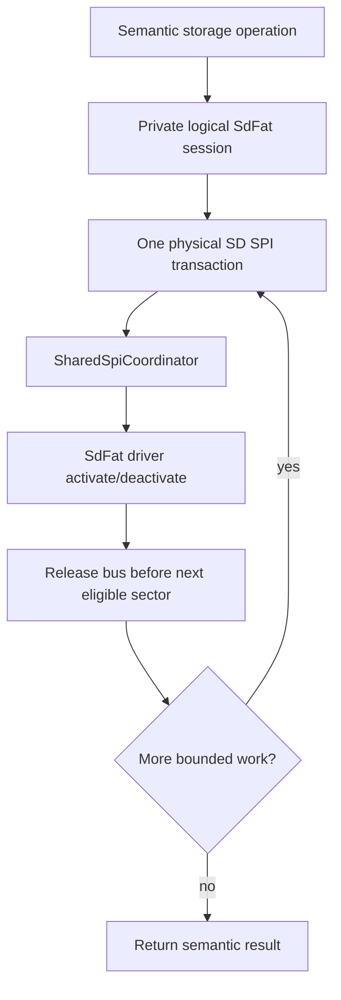
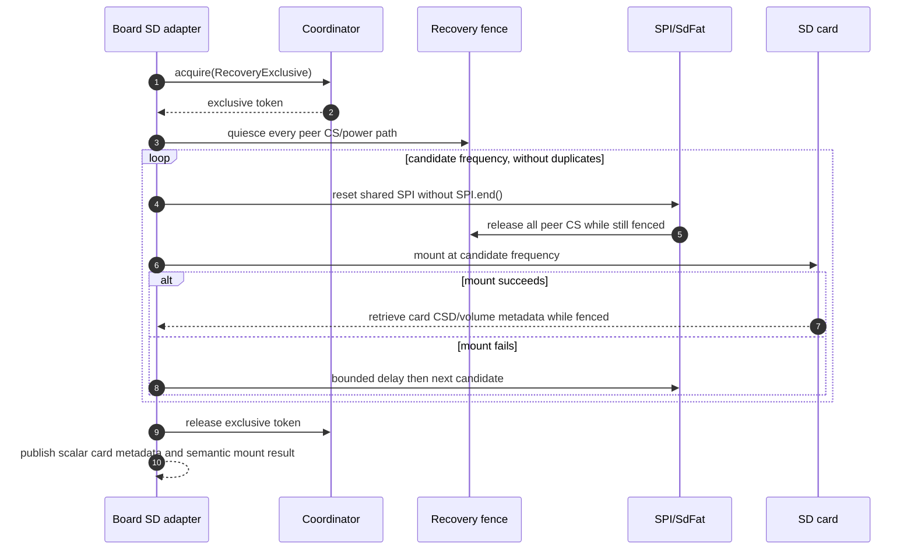

# Shared SPI SD Storage and Recovery Specification

## Authority and code map

This specification defines SD traffic and SD initialization/recovery on a
physical shared SPI bus. It is intentionally separate from the LVGL flush
contract: SD work cannot silently consume a display buffer, and display work
cannot manipulate SD power or mount state.

| Responsibility | Current code anchor |
| --- | --- |
| Shared-SPI SD mount/fallback helper | [sd_utils.h](../../platform/shared/include/board/sd_utils.h) |
| SdFat transaction/runtime adapter and explicit bus mapping | [sd_card_runtime.cpp](../../platform/esp/arduino_common/src/storage/sd_card_runtime.cpp) |
| Pager board SD setup | [TLoRaPagerBoard::installSD](../../boards/tlora_pager/src/tlora_pager_board.cpp) |
| T-Deck board SD setup | [TDeckBoard::installSD](../../boards/tdeck/src/tdeck_board.cpp) |
| T-Deck Pro board SD setup | [TDeckProBoard::installSD](../../boards/tdeck_pro/src/tdeck_pro_board.cpp) |
| USB Mass Storage raw-sector adapter | [platform_ui_usb_support_runtime.cpp](../../platform/esp/arduino_common/src/platform_ui_usb_support_runtime.cpp) |
| Coordinator recovery policy | [SharedSpiCoordinator](../../platform/esp/common/src/shared_spi_coordinator.cpp) |

## Two distinct SD scopes



The logical filesystem session serializes SdFat object use inside the device
adapter. It must not leak to business/UI code and must not imply physical bus
ownership for the duration of parsing, model updates, or a whole high-level
operation. The physical coordinator transaction is acquired at the SdFat
hardware boundary and is sliced at eligible sector boundaries (normally at
most one 512-byte sector where the driver permits it).

The LVGL SD filesystem callback is a semantic client of `SdRuntimeFile` and
`SdRuntimeDir`; it must not acquire an additional coordinator token around a
whole open/read/write/seek/directory callback. The runtime's SdFat driver hook
is the sole physical boundary. This prevents an LVGL file operation from
retaining the shared bus across heap ownership, path handling, multi-sector
work, or close/destruction while preserving the runtime's normal bounded
back-pressure behaviour.

The USB Mass Storage adapter follows the same boundary. Its host-ownership
session blocks application filesystem mutation semantically, but it does not
hold a physical coordinator token. A USB callback may process several sectors
and copy a partial-sector fragment in bounded static scratch storage; each
`sd_read_raw()` or `sd_write_raw()` independently enters the SD runtime and
reaches the SdFat driver hook for its physical transaction. USB must not create
a second resource ID, a callback-sized lease, or a nested coordinator token.

Calls such as open, metadata lookup, directory traversal, and close may still
be non-interruptible inside the underlying driver. The code must measure their
holds and avoid claiming a hard scheduler guarantee that cannot be enforced.

## SD initialization and frequency fallback

`installSpiSd()` is the common shared-SPI mount helper. Its intended sequence
is:



On a `SharedDisplaySpi` target this sequence has a mandatory precondition:
`displayFrameCompletions() > 0`. The common board runtime, each board's
`installSD()` entry, and `mount_sd_card()` itself enforce it. A pre-boot call
returns a deferred/failed mount result without driving SD power, CS, or SPI;
the normal launcher retries after the boot overlay's real display transaction.

The helper has no opt-out lock mode and accepts no board-local lock object.
Every invocation acquires `RecoveryExclusive` or returns without touching the
SD recovery path. This intentionally prevents a degraded display state from
turning into an unfenced SD mount. After its finite candidate session ends, it
releases the recovery token before publishing card metadata or mount results.

The current helper supplies `[configured frequency, 4 MHz, 1 MHz, 400 kHz]`.
For a Pager whose configured frequency is 8 MHz, the effective sequence is
`8 MHz -> 4 MHz -> 1 MHz -> 400 kHz`. Repeated candidate values are skipped.
The request advertises a 1000 ms deadline, but the current coordinator's
`RecoveryExclusive` policy caps an acquisition attempt at 500 ms; the
specification must describe the effective coordinator policy, not only the
caller-supplied number.

`SPI.end()` is forbidden between SD retries. The display owns the controller
configuration, so tearing down the shared controller can invalidate an
otherwise correct next display transaction. `SPI.begin()` may reassert the
pins only inside the exclusive recovery fence. The common helper passes an
explicit `SdSpiBusConfig` (controller plus SCK/MISO/MOSI) into the runtime; the
runtime retains that small scalar mapping and restores the same pins after
SdFat calls `end()`. `SdFat::end()` does not enter the driver's normal
activate/deactivate hook, so the runtime adapter must acquire a short recovery
token around that cleanup and its mapping restoration; if it cannot acquire
the token, it keeps the mount state intact and reports cleanup as deferred. It
must never assume that a board such as T-Deck Pro uses Arduino's global default
pin mapping.

## CS and power isolation contract

Before reset or SD mount traffic, the board must release every other device
that can drive MISO or interpret the shared clock/MOSI lines. The device set is
board-specific and must be declared in the
[board conformance specification](./SPI_BUS_BOARD_CONFORMANCE.md).

The crucial timing rule is:

```text
Outside RecoveryExclusive token:
  Do not drive a live display's CS merely to prepare an SD power cycle.

Inside RecoveryExclusive token:
  Drive SD CS and every peer CS inactive, establish required input/power state,
  reset/reconfigure SPI, then make each SD frequency attempt.
```

This prevents a runtime SD remount from asserting a display CS high while a
valid display transaction has already selected that panel. It is not safe to
fix a missing peer merely by adding it to an array that is also used before the
coordinator has been acquired.

## Pager-specific implementation

The Pager initializes the normal chip-select pins `LORA_CS`, `SD_CS`, and
`DISP_CS` inactive at boot, while `LORA_RST` remains in its separately named
reset list. Its optional SD power-cycle happens before the recovery token, so
it deliberately uses a LoRa-only peer list and never drives `DISP_CS` there.

The subsequent `installSpiSd()` call receives a different recovery peer list:
`LORA_CS` plus `DISP_CS`. The helper acquires `RecoveryExclusive` before it
uses that list in `resetSharedSpiForSd()`. This split is intentional: it keeps
the display-CS fence inside the ownership boundary without making the early
power-cycle sequence race a live display transaction.

## SD result and slow-card diagnostics

The selected mount frequency is a successful **initialization link setting**,
not a measured card throughput. Runtime diagnostics must keep these meanings
separate:

| Value | What it proves | What it does not prove |
| --- | --- | --- |
| Configured/fallback frequency selected | The card mounted at that SPI clock setting | Sustained write throughput or a V-class guarantee |
| Card type, capacity, sector size | Driver/card metadata | Signal quality during every later transaction |
| Mount attempt count and configured candidate | Recovery evidence | A permanent hardware root cause by itself |
| Measured bounded read/write benchmark | Observed application throughput for that test | SD Association video-class compliance |
| Coordinator wait/hold metrics | Contention and blocked-bus evidence | Electrical protocol errors hidden by a driver |

The current **Settings → Device → SPI & SD Diagnostics** panel shows mount
state, the selected successful initialization clock, configured first
candidate, attempt count, card metadata, coordinator/display counters and
hold/wait health. It labels the selected value *Successful init*, never card
speed. The snapshot is scalar-only; it does not add a sector buffer or retain
an unbounded attempt log. The exact operator contract is in the
verification/observability specification.

## Forbidden paths

```text
SPI.end() between shared-SPI SD fallback attempts
unfenced display-CS manipulation during runtime mount/recovery
SD logical session held across parsing or UI work
USB MSC callback held across several raw SD sectors or its memory copies
SD fallback status represented as measured card throughput
board-local recovery mutex around generic shared-SPI mount
```

## Required proof

- Host/structural test: the Pager startup CS set contains `DISP_CS`, while
  the recovery peer set contains `DISP_CS` only at the `installSpiSd()` call
  that is internally protected by `RecoveryExclusive`.
- Host test: each fallback retry has a recovery token and the token is released
  on every success/failure path.
- Target trace: cold mount and a forced remount log candidate frequency,
  selected frequency, card metadata, and peer-CS recovery stage.
- Contention test: SD retry while a display frame is active cannot shorten or
  falsely complete the LVGL flush.
- Structural test: USB MSC performs no direct coordinator acquisition; its
  raw-sector calls retain the runtime SdFat driver hook as the sole physical
  transaction owner.
