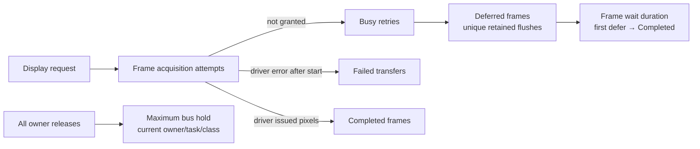

# Shared SPI Verification and Observability Specification

## Purpose

This document turns the shared-SPI architecture into falsifiable evidence. It
defines what a build, a host test, a target trace, and the future Settings
hardware diagnostics each prove—and, equally important, what they do not prove.

It applies to the complete specification set rooted at
[SPI_BUS_ARCHITECTURE_SPEC.md](./SPI_BUS_ARCHITECTURE_SPEC.md).

## Evidence hierarchy

| Evidence | Proves | Does not prove |
| --- | --- | --- |
| Source/structural check | Required callbacks, routing, forbidden API removal, pin-list placement | Timing and electrical behaviour on a device |
| Host coordinator test | Priority, FIFO, timeout cleanup, token matching, metric attribution | Arduino driver transfer/wiring |
| LVGL integration test | Original area/buffer survives Busy and completes only after same transfer | Panel pixels visibly changed |
| Target build | Compile/link/configuration compatibility | Runtime concurrency and hardware signal integrity |
| Target serial trace | Code exercised under the named workload; observed result and counters | Universal reproduction across cards/cables/power states |
| Electrical probe or panel readback/TE | Electrical/panel-specific evidence | General application correctness outside that measurement |

No test may report `physical_present` for a write-only display merely because a
software callback returned. The strongest ordinary software evidence is
`display_transaction_completed`.

## Required diagnostics model

The coordinator already exposes request/completion/busy/failure counts, release
mismatches, maximum bus hold, and current-owner metadata. The compliant model
adds the missing retained-frame dimensions:

| Field | Definition | Increment/update point |
| --- | --- | --- |
| `frame_requests` | Every `DisplayFrameCritical` acquisition attempt | Coordinator acquire |
| `completed_frames` | A display adapter reports `Completed` | After address window + pixels/EPD transfer returns successfully |
| `busy_retries` | An individual display acquisition did not obtain a token | Coordinator timeout/Busy result |
| `failed_transfers` | A terminal validation or driver failure | Typed adapter `Failed` result only |
| `deferred_frames` | A unique LVGL flush first receives `Busy` or `Unavailable` | Pending-flush record creation, once per flush |
| `maximum_frame_wait_ms` | Largest retained-frame time through its completion | Pending record completion |
| `maximum_bus_hold_ms` | Largest outer coordinator ownership interval | Coordinator release |
| `owner`, `owner_task`, `owner_class`, `owner_held_ms` | Current contention snapshot | Coordinator live metadata |

`Busy` and `Unavailable` must not increment `failed_transfers`. The typed
adapters return those retryable states separately, and the LVGL bridge
increments a failure only for terminal `Failed`. The structural check protects
this distinction; a forced-contention target trace remains required.

## Settings hardware diagnostics contract

The Settings surface is an operator tool, not a raw debug-log mirror. The
current entry is **Settings → Device → SPI & SD Diagnostics**. Its labels must
state their evidence level.

| User-facing field | Source | Label / presentation rule |
| --- | --- | --- |
| SD status, card type, capacity, filesystem | SD runtime metadata | Current state |
| Last successful SD initialization clock | `SdCardInfo.initialized_spi_hz` | `Successful init`, e.g. `8 MHz`; never label it card speed |
| Configured first candidate and mount attempts | Common fallback helper | Show configured MHz and count of distinct candidates attempted; this compact snapshot intentionally does not retain an unbounded path/history |
| Optional bounded read/write benchmark | Explicit user-triggered diagnostic | `Measured throughput`; include sample size and time, never infer from init clock |
| Display requests/completed/deferred/busy/failed | Coordinator + LVGL integration | Counters and a clear/reset-at-boot scope |
| Maximum frame wait and bus hold | Coordinator/integration | Milliseconds with "since boot" scope |
| Bus active, owner class, and held time | Coordinator scalar snapshot | Live snapshot; intentionally excludes owner/task strings so the UI does not copy unsafe pointer metadata |
| Release mismatches | Coordinator | Diagnostic warning; nonzero is actionable |

This UI does not diagnose a V10 class label or electrical quality by itself. A
V10 card class describes a sustained video-write capability under the card
standard's conditions; it does not promise that every host, voltage rail,
socket, signal path, SPI mode, or startup sequencing will initialize at 8 MHz.
The UI must present the observed initialization setting and configured value
separately; an actual throughput measurement is a different, explicit tool.

### Memory boundary for diagnostics

The operator view is deliberately bounded. The narrow UI contract is
[spi_diagnostics_runtime.h](../../modules/core_sys/include/platform/ui/spi_diagnostics_runtime.h):
its `Snapshot` is statically capped at 64 bytes and contains only scalar
facts. The ESP adapter reads coordinator state through
`SharedSpiCoordinator::RuntimeSnapshot` and SD metadata through `SdCardInfo`;
it neither requests I/O nor creates a pixel, sector, file, heap, or dynamic
attempt-history buffer. Settings owns a fixed 384-byte formatted-text buffer
and a 24-byte rate string in static storage. This is appropriate for a
human-triggered modal and does not grow an ESP task stack with display or SD
payload size.

## Mandatory tests

### Coordinator host tests

1. Priority ordering: an eligible display waiter wins over background after an
   existing transaction releases.
2. FIFO ordering: equal-class waiters win by sequence.
3. Deadline: a timed-out waiter is removed and cannot receive a later wake.
4. Token integrity: cross-task, stale-generation, depth-order, and duplicate
   releases increment mismatch diagnostics without clearing owner state.
5. Metrics: each status affects only the documented counters.

### LVGL display-contract tests

1. **Immediate completion:** flush sends once; LVGL completes once; no pending
   record.
2. **Initial Busy:** the integration does not call `lv_display_flush_ready()`
   or invalidate a recovery layer; the saved area and pointer are byte-for-byte
   the arguments supplied by LVGL.
3. **Repeated Busy:** every retry uses that same area/pointer; no second LVGL
   buffer is accepted while the first is pending.
4. **Busy then completion:** only the final successful transfer releases the
   flush; exactly one deferred frame and the correct wait maximum are recorded.
5. **Unavailable then recovery:** the buffer remains retained until a valid
   transfer completes.
6. **Terminal failure:** failure counter changes; the explicitly defined
   redraw/failure action runs without falsely counting Busy or Unavailable as
   failure.
7. **T-Deck Pro:** failed coordinator acquisition from `renderEpd()` returns
   `Busy`, not inherited success.

### SD recovery and board tests

1. Pager boot initializes `DISP_CS` with the normal inactive CS pins and keeps
   `LORA_RST` visibly separate.
2. Pager display CS is touched by SD recovery only after `RecoveryExclusive`
   acquisition; its pre-token power-cycle preparation does not manipulate it.
3. Every `installSpiSd()` mount exit releases a valid recovery token.
4. Candidate frequency order skips duplicates and records the selected value.
5. A display flush held/deferred while SD recovery starts cannot be completed
   without its own successful display transaction.
6. The LVGL SD filesystem adapter acquires no coordinator token around a
   callback. SdRuntimeFile/SdRuntimeDir invoke the runtime SdFat driver hook,
   which remains the sole physical transaction boundary.
7. T-Deck Pro rasterizes an EPD page without a lease and acquires one only for
   the GxEPD2 `nextPage()` hardware submission; a missed page acquisition
   returns `Busy` for the retained LVGL frame.
8. USB Mass Storage holds only semantic host ownership; each raw SD sector
   uses the runtime SdFat driver boundary rather than a coordinator token
   around an entire USB callback.

## Target-validation scenarios

| Scenario | Setup | Expected evidence |
| --- | --- | --- |
| Cold boot with normal SD card | Clean power-on, normal card | First display transaction completes before shared-SPI storage gate opens; selected init clock logged |
| Forced display contention | Hold a bounded lower-priority SD transaction while requesting a frame | LVGL retains original buffer, deferred/busy counters rise, frame completes later |
| SD fallback | Controlled card/fixture or deterministic mount-failure seam | Exact candidate trace, no `SPI.end()`, peer CS fence recorded |
| EPD contention | T-Deck Pro frame while coordinator is held | EPD reports Busy then completes only on actual retry |
| Storage load | Hydration/maintenance plus repeated redraws | No dropped flush-success events; hold/wait values remain explainable |
| Card diagnostics | Card mounted at each fallback outcome | UI says `SPI init clock`, not throughput; explicit benchmark distinguished when run |

PlatformIO target builds are part of this verification but do not replace these
scenarios. Long builds must run to an explicit process exit and their result
must be captured independently of a shell timeout.

## Release checklist

- [ ] Board conformance matrix updated.
- [ ] All direct SPI/CS changes remain in platform or board adapters.
- [ ] Symbol impact analysis performed before each implementation edit.
- [ ] Structural checks and host tests pass.
- [ ] Required shared-SPI target builds pass.
- [ ] Target trace covers first frame, contention, and SD initialization.
- [ ] Settings labels distinguish configuration, observed result, and measured
      throughput.
- [ ] `detect_changes()` reports only intended SPI/display/storage/startup/test
      flows before commit.
