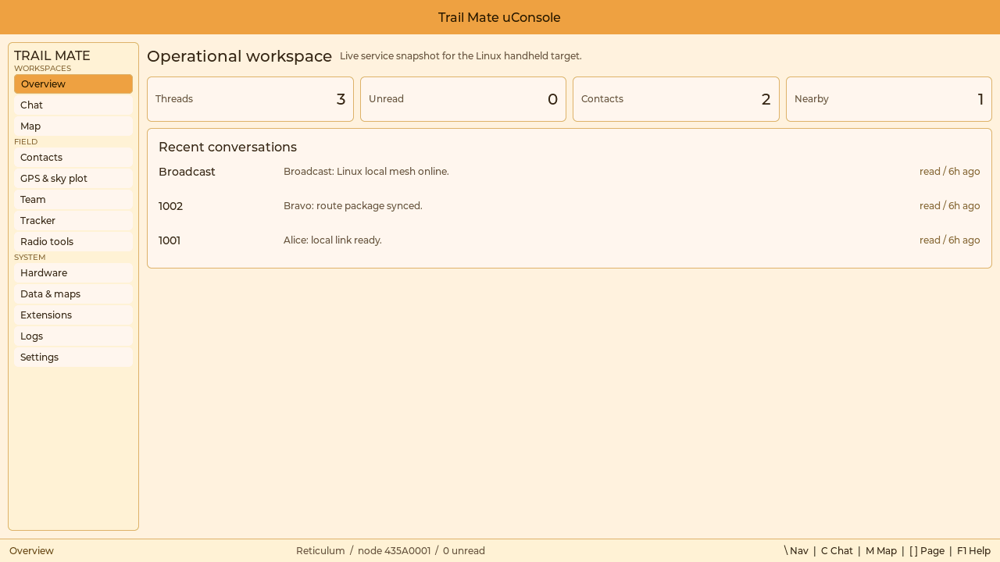
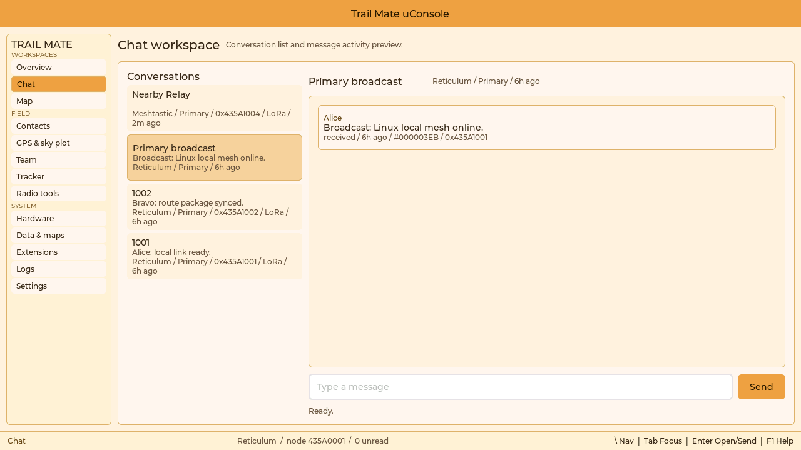
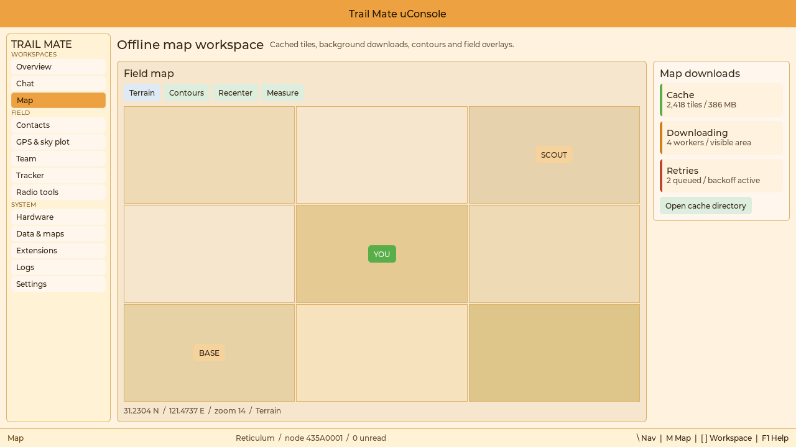
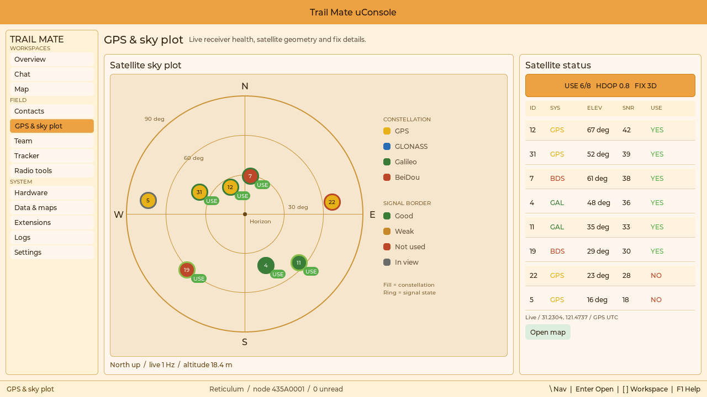
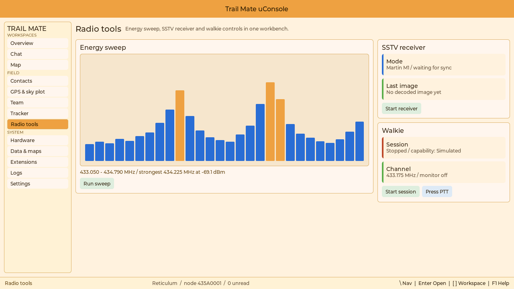
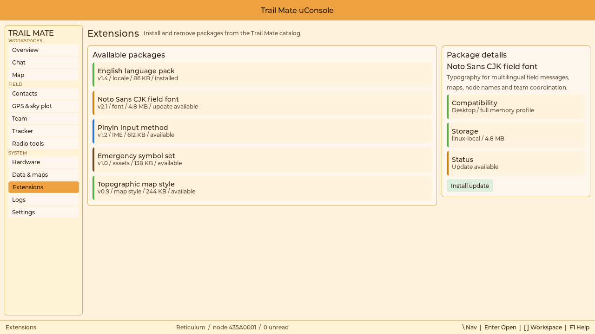
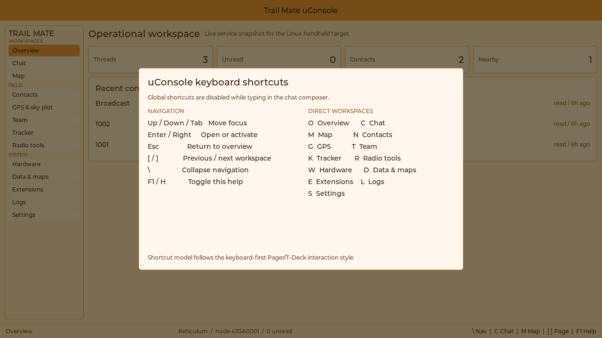
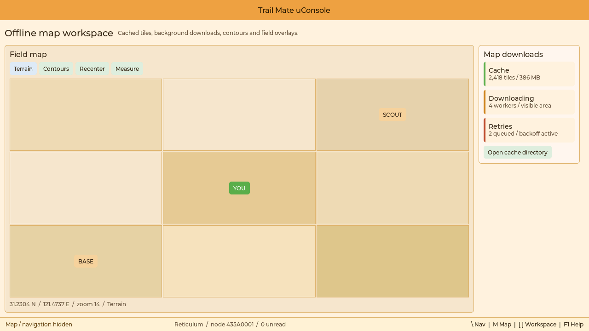

# uConsole SDL visual review

This review captures the uConsole 1280 x 720 desktop interaction model through
the repository's real SDL3 presenter. The screenshots are not hand-built
mockups: the capture executable boots the LVGL uConsole shell, navigates it
through its normal keyboard input path, renders each frame into an SDL3
renderer, and reads the final pixels back with `SDL_RenderReadPixels`.

Capture date: 2026-07-23

SDL version: 3.4.10

Canvas and window size: 1280 x 720

Capture frame: 45 after shell startup
Runtime mode: isolated simulator demo data

## Visual acceptance criteria

| Area | Review result |
| --- | --- |
| Navigation | The 168 px rail keeps all 13 workspaces grouped and reachable, but `\` collapses it when the active task benefits from the full width. Direct workspace keys avoid repeated rail traversal. |
| Desktop density | The 44 px title bar, 36 px page header, 30 px status bar, inline metrics, single-line activity rows, and content-height utility panels prevent sparse data from being stretched into large empty cards. |
| Style consistency | The shell now uses the embedded theme's cream page and card surfaces, amber title bar and active states, brown typography, gold borders, and existing blue/green/warning status colors. The desktop layout changes density and information architecture, not product identity. |
| Desktop adaptation | Wide screens use task-focused master/detail panes and contextual summaries. Hardware state, contacts, map controls, and download details are no longer duplicated on every page. |
| Keyboard operation | The bottom bar always exposes the current workspace, runtime summary, and relevant keys. `F1` or `H` opens the complete shortcut reference; global letter shortcuts are suspended while typing in chat. |
| Map behavior | The map page shows cached tiles, background worker count, retry state, total cache size, and a direct cache-directory action. Automatic map download remains a desktop-specific capability. |
| Protocol boundary | UI capture uses Trail Mate's native runtime and demo data. It does not introduce or invoke `meshtasticd`. |
| Capability honesty | The overview and radio pages distinguish detected, unavailable, and simulated capabilities rather than presenting every desktop backend as physical hardware. |

## Embedded palette parity

The capture deliberately uses the same core values as the ESP32 UI rather than
introducing a separate Linux gray/green theme:

| Token | Value | Desktop use |
| --- | --- | --- |
| Page background | `#FFF3DF` | Application canvas |
| Surface / alternate surface | `#FFF7E9` / `#FFF0D3` | Cards and navigation rail |
| Dashboard panel | `#FAF0D8` | Lists, message area, and workbench rows |
| Accent / dark accent | `#EBA341` / `#C98118` | Title bar, selected navigation, and attention states |
| Border / separator | `#D9B06A` / `#E8D2AB` | Desktop pane and card boundaries |
| Primary / muted text | `#3A2A1A` / `#6A5646` | Main copy and secondary metadata |
| Status green / blue | `#5BAF4A` / `#2F6FD6` | Healthy and informational states |
| Map / probe background | `#F6E7C8` / `#F2E4C8` | Map tiles, sky plot, and Protocol Probe |

The canonical shared values come from
`modules/ui_shared/include/ui/ui_theme.h`; the dashboard-specific panel,
accent, and text values are aligned with
`modules/ui_shared/src/ui/menu/dashboard/dashboard_style.cpp`. The uConsole
shell keeps those colors in a named local palette so its desktop-only widgets
do not scatter unrelated literals through the renderer.

## Information architecture

The revised shell follows a task-first rule: one dominant work surface, one
optional contextual inspector, and no unrelated persistent detail rail.

- Overview shows only four inline counters and recent conversation activity.
  Full capability diagnostics belong to Hardware; full node lists belong to
  Contacts.
- Map uses the canvas as the dominant surface. Layer and navigation actions are
  a compact toolbar, while automatic-download health is a small contextual
  inspector.
- GPS keeps the sky plot dominant and adapts the Pager GNSS visual language to
  a desktop split view: the plot remains spatial, while the right side becomes
  a compact satellite status table.
- Radio tools and Extensions size themselves to their actual contents instead
  of extending bordered panels to the bottom of the screen.
- Chat intentionally retains a large transcript viewport because its empty
  space becomes message history during normal operation.

## Overview

The overview is now an activity index, not a page that duplicates every
subsystem. Counters are inline, conversations use desktop-style single-line
rows, and the card stops at its real content height.



## Chat workspace

The chat workspace uses a conversation master pane and a message detail pane.
The layout preserves the existing Trail Mate chat model and native protocol
stack while making keyboard and pointer navigation efficient.



## Offline map and automatic download

The map workspace reserves the largest area for field context. Layer controls
move into a short toolbar above the map; automatic-download health remains
visible as a narrow contextual inspector on the right. Downloading is global
and continues independently of the selected page.



## GPS and satellite sky plot

GPS diagnostics reuse the Pager sky-plot rules instead of treating the chart as
a decorative radar. Azimuth rotates clockwise from north, elevation projects
from the horizon toward the zenith, circle fill identifies the constellation,
the outline identifies signal state, and an explicit `USE` tag marks satellites
used in the fix. Ring captions preserve the Pager `90° / 60° / 30° / Horizon`
convention. The wide screen adds a persistent
`ID / SYS / ELEV / SNR / USE` table without weakening those embedded
conventions. Fix quality and the map transition remain visible without opening
a modal.



## Radio tools workbench

Protocol Probe, SSTV, and Walkie retain independent runtimes and controls but are
grouped into one desktop workbench. This reduces navigation depth without
removing any ESP32 capability.



## Extensions

Extensions use a catalog/detail split appropriate for package browsing on a
desktop. Package compatibility, storage, and install state remain explicit.



## Bottom status bar and keyboard shortcuts

The 30 px bottom bar is persistent on every workspace:

- Left: current workspace and whether navigation is hidden.
- Center: active mesh protocol, local node, and unread count.
- Right: the most relevant keys for the active workspace.

The global shortcut set follows the keyboard-first Pager/T-Deck interaction
model:

| Key | Action |
| --- | --- |
| `Up`, `Down`, `Tab` | Move focus |
| `Enter`, `Right` | Open or activate the focused control |
| `Esc` | Return to Overview; closes shortcut help first |
| `[` / `]` | Previous / next workspace |
| `\` | Collapse / restore the navigation rail |
| `F1` or `H` | Toggle shortcut help |
| `O`, `C`, `M`, `N`, `G`, `T` | Overview, Chat, Map, Contacts, GPS, Team |
| `K`, `R`, `W`, `D`, `E`, `L`, `S` | Tracker, Radio tools, Hardware, Data & maps, Extensions, Logs, Settings |

Letter shortcuts are not consumed while the chat composer owns focus, so normal
message entry remains intact.



## Collapsible navigation

The map capture below sends normal keyboard navigation to open Map and then
sends `\` through the same input path used by the application. The rail is
removed from layout, the map expands immediately, and the bottom-left status
explicitly reports that navigation is hidden.



## Reproduce the capture

The capture target is opt-in and does not change the normal GTK package build.
Provide an SDL3 CMake package, configure the target, build it, and run the
capture executable from the repository root:

```sh
cmake -S apps/linux_uconsole_gtk -B build/uconsole-sdl \
  -DTRAIL_MATE_UCONSOLE_BUILD_REAL_GTK_UI=OFF \
  -DTRAIL_MATE_UCONSOLE_BUILD_SDL_SCREENSHOT_CAPTURE=ON \
  -DBUILD_TESTING=OFF \
  -DCMAKE_PREFIX_PATH=/path/to/sdl3

cmake --build build/uconsole-sdl \
  --target trailmate_uconsole_sdl_screenshot_capture

SDL_VIDEODRIVER=dummy \
SDL_RENDER_DRIVER=software \
build/uconsole-sdl/trailmate_uconsole_sdl_screenshot_capture \
  docs/specs/images/uconsole-sdl
```

The tool captures `overview`, `chat`, `map`, `gps-sky-plot`, `radio-tools`,
`extensions`, `sidebar-collapsed`, and `shortcut-help`. The final two captures
exercise actual shortcut input rather than forcing widget visibility. Runtime
state is stored under `.codex-build/uconsole-sdl-runtime` so visual verification
does not read or overwrite the user's normal Trail Mate settings.

## Verification boundary

These images validate the LVGL/fbdev/SDL shell's composition, density, keyboard
navigation, and shared uConsole interaction model at the target resolution.
GTK4 remains a separate widget renderer, so its exact font metrics and native
widget geometry still require a GTK4-capable target check. The SDL review is
therefore a real executable visual gate for the shared design, not a claim that
SDL pixels are identical to GTK pixels.
